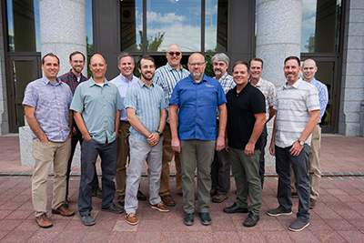

#### Quick Links

- [AGRC Contacts]()
- [AGRC Mission]()
- [GIS-related Utah Statute]()
- [AGRC Policies]()
- [AGRC Media Resources]()
- [AGRC Directions and Parking]()
- [Contributing to this website]()
{: .dotless }

## Our Background
{: .text-left }

The Automated Geographic Reference Center (AGRC) is the State of Utah’s map technology coordination office. AGRC staff ([directory/contacts]()) have knowledge of and experience with geographic information system (GIS) desktop software, hosted map- and web-services, mapping data resources, and GIS professionals and their activities around the state. Since 1984, we have been [encouraging and facilitating](https://storymaps.arcgis.com/stories/8be2e6de2abf442eb72f5faa8a32dd2b) the effective use of geospatial information and technology for Utah.

We are located on the 5th floor of the State Office building, directly north of the Capitol [directions and parking]().  AGRC and the Utah CIO’s office compose the Integrated Technologies division within the Department of Technology Services.

[{: .outline}](./AGRC_Staff_2019.png)
{: .pull-right .pad-left loading="lazy" }

AGRC is directed under [mapping-related sections of Utah statute]() to coordinate GIS resources within state government including the management of the State Geographic Information Database (SGID) and the operation of [The Utah Reference Network for Global Positioning Systems (TURNGPS)](http://turngps.utah.gov) that provides high precision correction services for surveying, mapping, and machine control.

AGRC was one of the first geospatial information offices in the country, established a few years before its formal adoption in code in 1984. At 30+ years old, our full name may sound like its from a by-gone era. But AGRC is how people know us, so we're sticking with it. Years may pass, but our storefront remains located at the intersection of geography, technology, and the quest for enterprise-wide efficiency.

AGRC is funded through a combination of State general and restricted funds and cost-recovery revenue sources from project work and grant awards. This hybrid approach ensures some stable base for SGID and coordination activities but keeps us on our toes by requiring us to keep up with the latest developments in our field so we can offer cutting edge GIS consulting services to those in need.

## What We Do at AGRC

  

- [Utah’s State Geographic Information Database]()
- [Address Geocoding Services]()
- [Aerial Photography]()
- [Base Maps Web Services]()
- Broadband Mapping Support
- [Cartwheels]()
- Custom Cartography
- [Custom Web Map Apps]()
- Data Acquisition Partnerships & Contracting
- [GIS Coordination Newsletter]()
- [gis.utah.gov website]()
{: .dotless .no-padding }

- [Google Imagery License]()
- [Lidar Elevation Models]()
- Location Analytics
- [911 Map Data Support](  )
- [Municipal](https://municert.utah.gov), Voting, and other Civic Boundaries
- [Public Land Survey System](https://plss.utah.gov)
- Spatial Database Design, Integration and Hosting
- [Statewide Address Point Aggregation]()
- [Statewide Road Centerline Aggregation]()
- [Statewide GIS Strategic & Business Plans]()
- [TURN GPS sub-centimeter precision]()
{: .dotless .no-padding }

## GIS Organizations & Affiliates

  

### Statewide

- [Utah Geographic Information Systems Advisory Council (GISAC)]()
  - GISAC is composed of individuals from many state agencies all working together to further the cause of GIS in Utah. AGRC is trying to create a forum in which all levels of GIS expertise can mingle, learn from each other, and learn of each other's challenges. GISAC also sends recommendations to the CIO as potential rules or recommendations that would enhance GIS coordination and cooperation throughout Utah.
  {: .dotless }
- [Utah Geographic Information Council (UGIC)](https://ugic.org)
  - UGIC is a nonprofit organization whose mission is to lead the effective application of geographic information in Utah. It is their vision to provide a modern, accurate, documented, and accessible geospatial information infrastructure for all of Utah.
  {: .dotless }
{: .dotless }
  

  

### Local

- [Salt Lake User Group (SLUG)](http://www.slug-gis.info/)
  - SLUG brings together GIS practitioners in the core of the urbanized Wasatch Front with interesting presentations and discussions about GIS.
  {: .dotless }
- [Other local level GIS User Group info]()
{: .dotless }
  

  

### National

- [National States Geographic Information Council (NSGIC)](https://nsgic.org)
  - NSGIC promotes the coordinated, impactful, and cost-efficient application of GIS and other location-based information and analytics to best serve the nation, with emphasis on the power of initiatives and public policy that connect across local, state, federal, and private sector partners.
  {: .dotless }
{: .dotless }
  

### GIS Events

- [Utah Geographic Information Council Annual Conference (UGIC)](https://ugic.org)
  - The UGIC Conference is the premiere Utah GIS conference. It is a great way to meet local GIS professionals and stay current on what is happening with GIS trends.
  {: .dotless }
- [Annual UGIC Maps on the Hill (MOTH)]()
  - MOTH is an excellent opportunity for students and professionals to share maps, mapping tools, and mapping projects with elected officials, fellow practitioners, and the public.
  {: .dotless }
- GIS Day
  - GIS Day showcases geospatial technologies to students to make them aware of the possibilities and capabilities of geographic information technologies and much more!
  {: .dotless }
{: .dotless }
