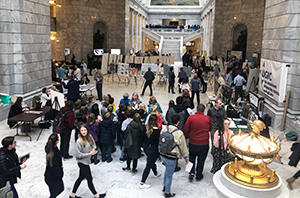
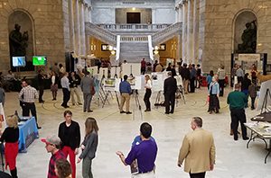
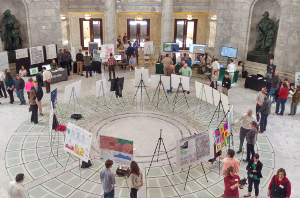

 Maps on the Hill, an event held at the State Capitol during the Utah Legislative Session, is supported by the Utah Geographic Information Council ([UGIC](http://ugic.info/)) and AGRC. The event highlights interesting maps and mapping technology with elected officials, fellow practitioners and the public. Students and professionals present on a broad range of topics to show the diversity of mapping resources in Utah, and to demonstrate how mapping technology can be used to support decision makers.

  

#### Maps on the Hill 2019

{: .outline }

- [Map Book Calendar](https://drive.google.com/a/utah.gov/file/d/1bDUTg92jhrskI7BCljlRww2fNvFTYmTp/view?usp=sharing)
- Photos (Coming soon)
{: .dotless .no-padding}
  

  

#### Maps on the Hill 2018

{: .outline }

- [Map Book](https://drive.google.com/file/d/1i4_Lm8E0Rb2GpETe1K43DgkKD6maFufy/view?usp=sharing)
- [Photos](https://drive.google.com/drive/folders/1Vn9oYHVd1-mvQTA0TYB4yoNcSc0r50md?usp=sharing)
{: .dotless .no-padding}
  

  

#### Maps on the Hill 2017

{: .outline }

- [Map Book](https://drive.google.com/file/d/0BxoOAQyOvGgaNmdVdC1XSFVWdms/)
{: .dotless .no-padding }
  

  

#### Maps on the Hill 2016

{: .outline }

- [Map Book](https://drive.google.com/file/d/0B0ScYXX9W5INQzdEZk40cVFnY2M/view)
- [Photos](https://drive.google.com/folderview?id=0B2TozNhMXSiedlBmREtjdzFEUHc&usp=sharing)
{: .dotless .no-padding }
  

  

#### Maps on the Hill 2015

{: .outline }

- [Map Book]({{ "/downloads/Maps-on-the-Hill-2015-Book-80-pages-FINAL-web.pdf" | prepend: site.baseurl }})
- [Photos](https://www.flickr.com/photos/118521371@N02/sets/72157650544752656/)
{: .dotless .no-padding }
  

  

#### Maps on the Hill 2014

{: .outline }

- [Map Book]({{ "/downloads/Maps-on-the-Hill-Map-Book-2014-web.pdf" | prepend: site.baseurl }})
- [Photos](https://www.flickr.com/photos/118521371@N02/albums/72157641427057164)
{: .dotless .no-padding }
  

  

#### Maps on the Hill 2013

{: .outline }

- [Map Book]({{ "/downloads/MapsontheHillMapBook2013.pdf" | prepend: site.baseurl }})
{: .dotless .no-padding }
  

  

#### Maps on the Hill 2012

{: .outline }

- [Map Book]({{ "/downloads/2012MapsOnTheHill_bookletSM.pdf" | prepend: site.baseurl }})
{: .dotless .no-padding }
  

