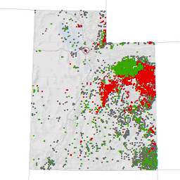

---
author:
  display_name: Bert Granberg
  email: ugrc@utah.gov
tags: []
date: 2012-06-14 17:13:42 -0600
title: Utah Oil and Gas GIS Data Updates
published: false
category: SGID Updates
cover_image: /src/images/pillar-blog/2012-06-14-utah-oil-and-gas-gis-data-updates/utah-oil-and-gas-wells.png
cover_image_alt: utah oil and gas wells
---

Utah Oil and Gas Well GIS Data

As a reminder, the GIS dataset depicting Utah Oil and Gas Wells is updated nightly on UGRC's ArcSDE (v.10) database server, via a database connection to the Division of Oil, Gas and Mining (DOGM).

The updated feature classes include Energy.DNROilGasWells, Energy.DNROilGasWells_HDBottom, and Energy.DNROilGasWells_HDPath. The latter two represent the bottom of the hole and 2D drilling path for horizontally drilled wells.

Also, the GIS dataset depicting Utah Oil and Gas Wells Unit polygons was updated today from data sent from DOGM. This data is updated periodically as needed.

A snapshot of the datasets mentioned above, together with Oil and Gas Field polygons was exported to shapefile and file geodatabase formats. These files are downloadable, via a browser, from the SGID ftp site using the second link below.

Additional information:

<ul>
<li><a title="How to Connect to the SGID via ArcSDE" href="/documentation/sgid/open-sgid">Connecting to the SGID10 SDE Server</a></li>
<li><a title="Oil and Gas" href="/products/sgid/energy/">Oil and Gas dataset content, interactive map, and data download links</a></li>
</ul>
