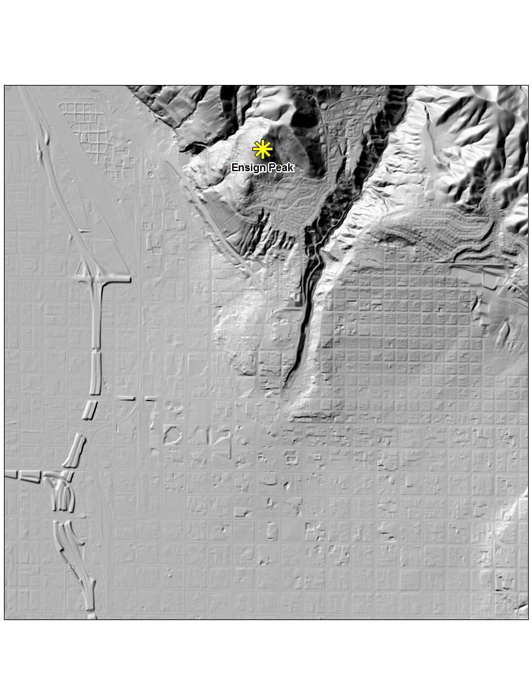
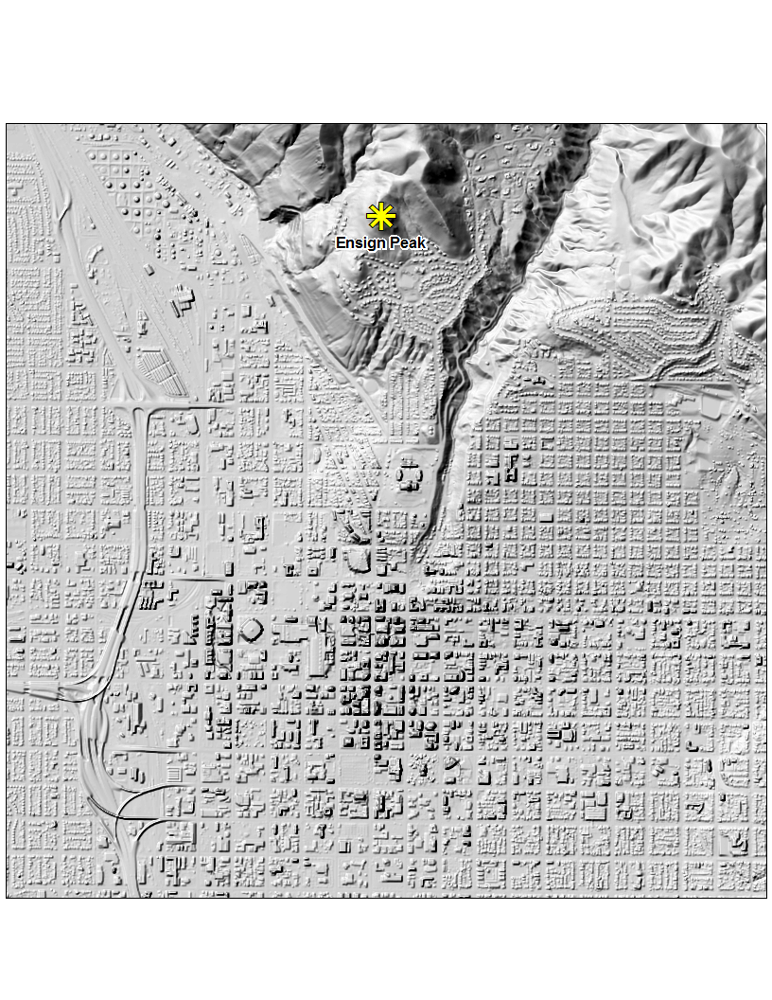
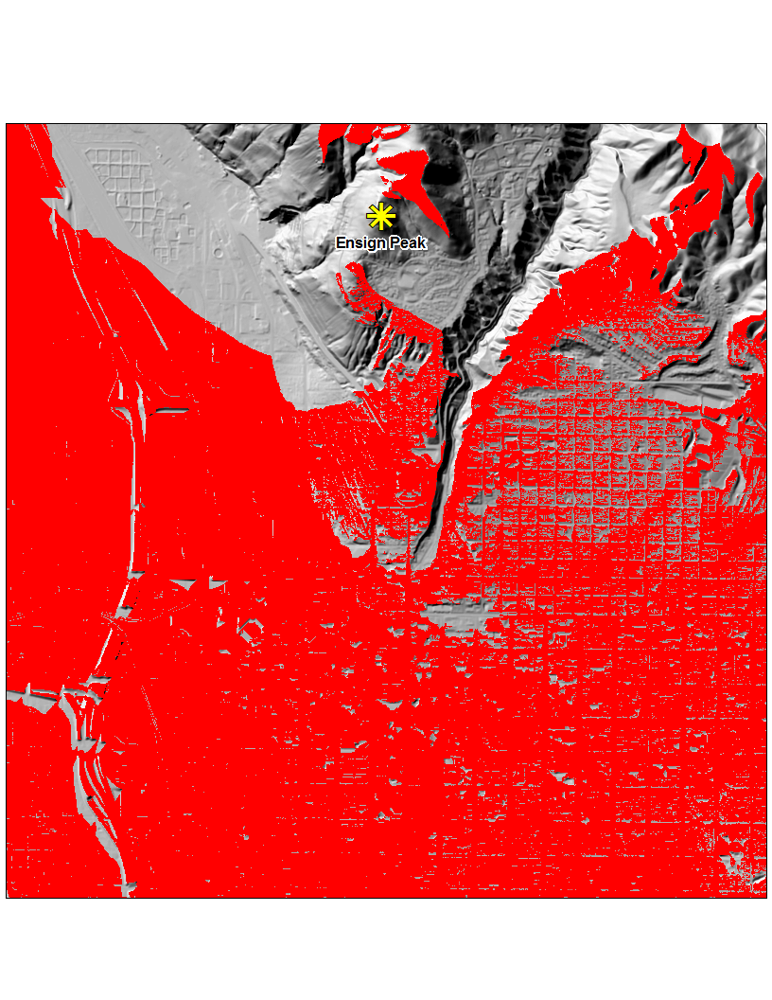
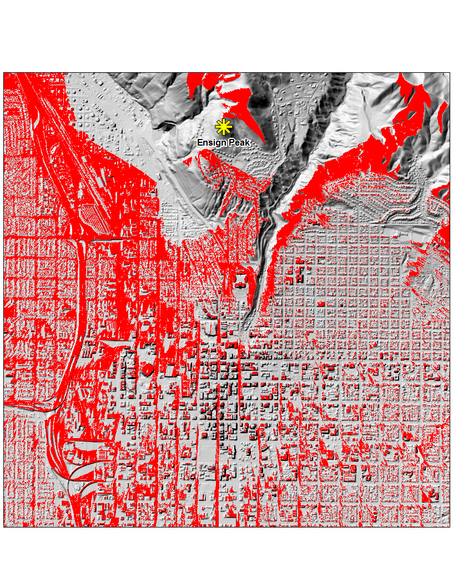
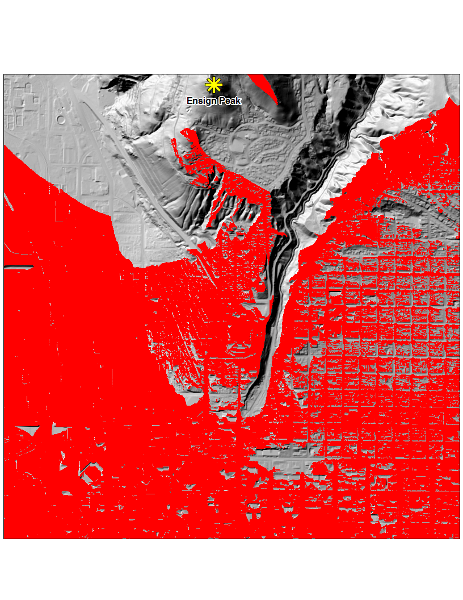
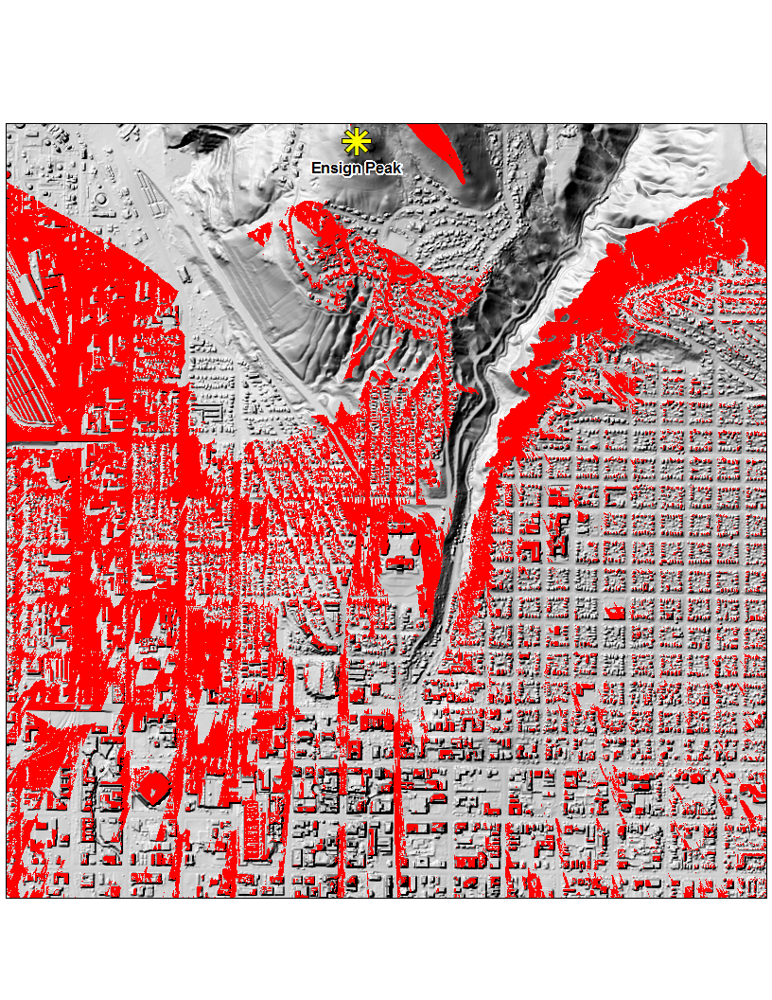
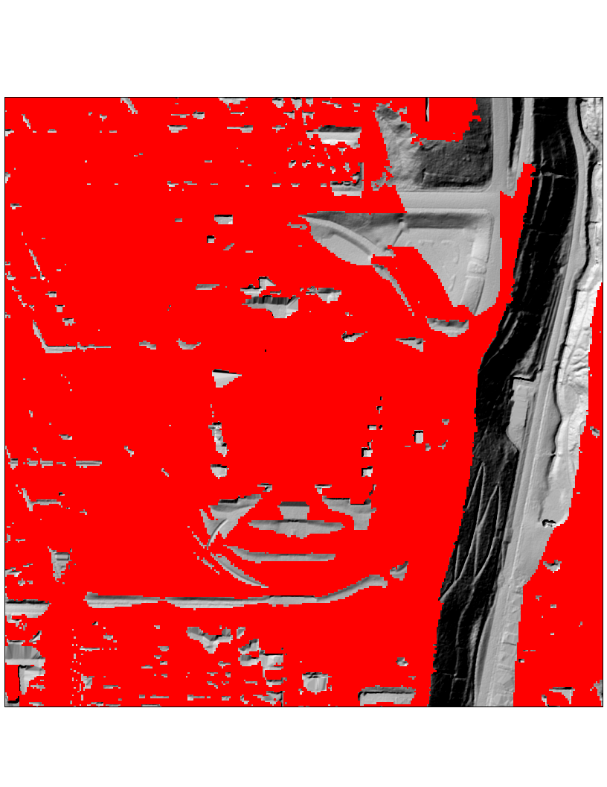
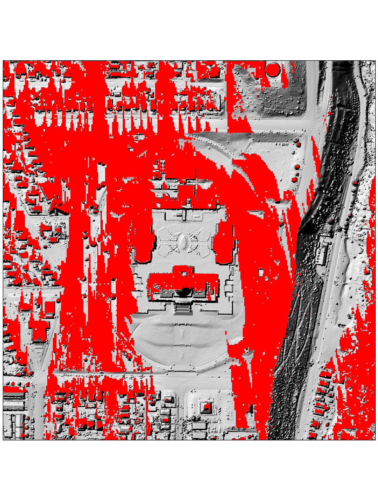

---
author:
  display_name: Rick Kelson
  email: rkelson@utah.gov
tags:
  - digital elevation model
  - digital surface model
  - digital terrain model
  - lidar
  - viewshed
date: 2014-11-17 12:15:04 -0700
title: Wireless Signals and LiDAR Derived Elevation Models
category: SGID Blog
---

Specialized software allows the modeling of cellular, radio, or wireless internet signal propagation and coverage. Better, more accurate results for wireless signal propagation depend on the precision with which the earth’s surface is represented within the analysis software. Traditionally, "bare earth" Digital Terrain Models (DTMs), in which above ground features such as buildings and vegetation are not represented, are used for the analysis.

Airborne-collected LiDAR data has more sophisticated capabilities for representing the earth and its features, and is becoming more available. LiDAR sensors mounted on planes uses a scanning laser range finder to collect and model a truer 3D representation. So-called "first return" Digital Surface Models (DSMs) maintain both ground and above ground surface features including buildings and vegetation. For this reason, LiDAR DSMs can be utilized to help the analysis software more accurately model cellular, radio, or wireless coverage and signal propagation.

A simple way to compare the different results from the traditional DTM and the LiDAR-sourced DSM is with a GIS "viewshed" tool. A Viewshed tool determines the surface locations visible from an observation point, in our case, a cellular, radio, or wireless internet tower. In the examples below, a communication tower is set at the top of Ensign Peak just a few blocks to the north, above of the Utah State Capitol building.

In the model result graphics below, the red areas show, _at 3 different scales_, the areas that have clear visibility from the tower site using the DTM and, it's LiDAR counterpart DSM. With all other factors held constant, the significant variation in the results is easy to see.

The DTM and DSM elevation models from the 2013-2014 Wasatch Front LiDAR Elevation Data used to generate these models can be downloaded from [here]().

**Important Note**: In addition to a surface models that represents the physical world, wireless network planning and other radio signal propagation software utilize many parameters to model coverage such as signal frequency, transmitter angle, earth curvature, Fresnel Zone, etc. Simple GIS Viewshed analysis, as shown, does not completely model wireless signals and their varying ability to bend and reflect but it does illustrate the possible impact of using surface model inputs that represent the physical world with differing amounts of precision.

Figure 1: Bare-Earth Digital Terrain Model

Figure 2: First-Return Digital Surface Model

Figure 3: Bare-Earth Digital Terrain Model and Viewshed

Figure 4: First-Return Digital Surface Model and Viewshed

Figure 5: Medium Zoom Bare-Earth Digital Terrain Model and Viewshed

Figure 6: Medium Zoom First-Return Digital Surface Model and Viewshed

Figure 7: Zoomed In Bare-Earth Digital Terrain Model and Viewshed

Figure 8: Zoomed In First-Return Digital Surface Model and Viewshed

