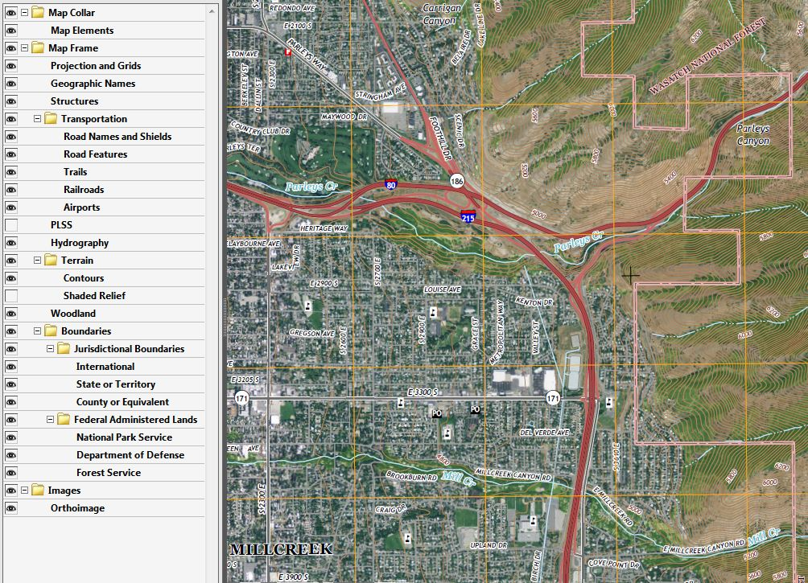

---
author:
  display_name: Rick Kelson
  email: rkelson@utah.gov
tags: []
date: 2014-12-11 16:37:15 -0700
title: USGS GeoPDF Topographic Maps
category: SGID Blog
cover_image: /src/images/pillar-blog/2014-12-11-geopdfs/geopdf.jpg
cover_image_alt: map
---

Want an aerial photograph and a topographic map all packaged into one file, in a pdf format? Then the [USGS GeoPDFs](https://apps.nationalmap.gov/downloader?basemap=b1&category=histtopo,ustopo&title=Map%20View) may be the answer. These GeoPDFs are similar to the 1:24,000 scale, legacy 7.5-minute quadrangle format paper maps but with updated maps features such as transportation, names, boundaries, hydrography, PLSS and topographic contours. Additional these GeoPDF maps contain an aerial photography layer and a shaded relief surface model. All these layers in the GeoPDF can be turned on or off as the users desires. The image at the bottom of this page is a sample of the map layer table of contents and the associated USGS topographic map. These layers vary some from map to map depending on their locale.

These files can be opened with Adobe products like Acrobat Reader. A free add-in, from the producer of the GeoPDFs, [TerraGo toolbar](https://www.terragotech.com/products/terrago-toolbar) can be downloaded to add advanced geospatial tools to Adobe. Some of these TerraGo tools include the ability to obtain XY coordinates for a location, go to XY coordinates, identify features, measure length or area and more.

While these .pdf files cannot directly be added into ArcGIS products, various software like Global Mapper can export the .pdf files to an image format that can be added into ArcGIS products.

The GeoPDFs can be downloaded from the [USGS National Map](https://apps.nationalmap.gov/downloader?basemap=b1&category=histtopo,ustopo&title=Map%20View) or accessed from links obtained from the UGRC's [Raster Data Discovery](https://raster.utah.gov/?cat=24K%20GeoPDF) application.

