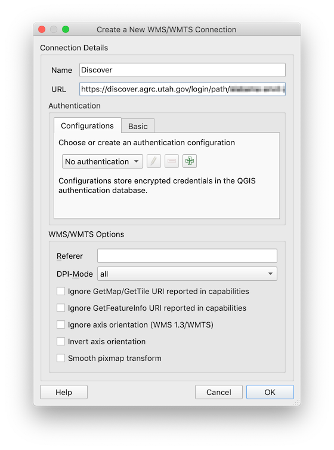
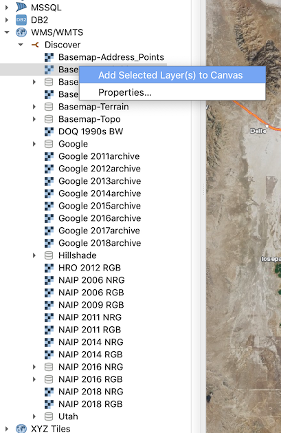
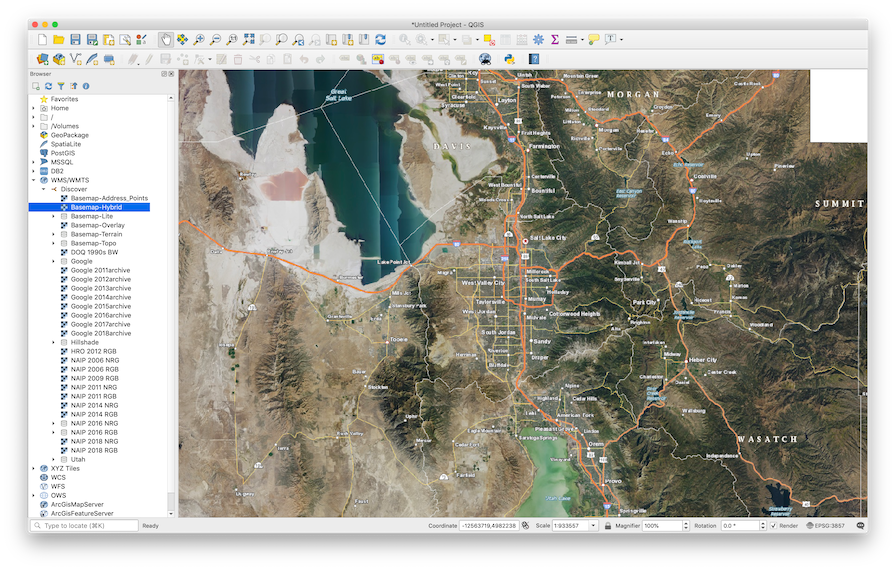

Most people know about UGRC's awesome [base maps](/products/sgid/base-maps). They are very popular and provide high quality cartography using the latest and greatest data from the [Utah SGID](/products/sgid). But did you know that they provide a [WMTS](https://en.wikipedia.org/wiki/Web_Map_Tile_Service) service that can be consumed in non-ESRI products?
Here's how to load our base maps in [QGIS](https://www.qgis.org/en/site/) (v3.4.9 as of this writing):

1. The first step is to [sign up for a free account](/products/discover) and request a quad word. This will enable you to authenticate with the `discover.agrc.utah.gov` base map server.
1. Open QGIS and right click on "WMS/WMTS" in the browser panel and select "New Connection".
1. Give the new connection a name and paste in this URL: `https://discover.agrc.utah.gov/login/path/{your-quad-word-here}/wmts/1.0.0/WMTSCapabilities.xml`
   
1. You should now see a new connection in the browser panel under "WMS/WMTS". Expand the new connection and right-click on a layer and select "Add Selected Layer(s) to Canvas".
   
1. You should now be able to view the base map as a layer in QGIS!
   
