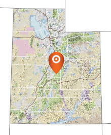

### Geocoding Assurance _or_ Why you should trust the results

The UGRC [web api](https://api.mapserv.utah.gov) is a great resource for deriving information from the [SGID](/products/sgid). Geocoding an address is one of the more popular and useful free services. But it is important that users have confidence in the match results returned from the geocoding api.

As you may know, the geocoding api uses [address points and road centerlines](https://api.mapserv.utah.gov#geocoding) to locate the best match when geocoding. Or, users may specify that the matches come only from centerline or address points. Each of the 29 Utah counties provide UGRC with a periodic update of their local road centerline and address point data. This schedule allows the geocoding api to use the most current data in order to provide the best match results.

Comprehensive updates, which are new roads, subdivisions, and road name and address range changes, are made to **1 urban county** _(Davis, Salt Lake, Utah, Washington, or Weber)_ and **2 rural counties** on a **monthly** cadence. For a given month, the **other four** urban counties receive new road and subdivision updates only. The counties chosen for update are based on a [round robin schedule](https://docs.google.com/spreadsheet/ccc?key=0Aj18jufMWioidENRNDhPb3VtRTFGamJfYzlPal9TNmc&usp=sharing). It is important to keep in mind that the these statewide layers would not be possible without the active partnership of, and excellent work performed by local government GIS staff over the years!

UGRC partners with many **911 Call Centers** (aka PSAPs) and the **Blue Stakes of Utah Utility Notification 811 Center** to receive address improvement feedback. This feedback is given to UGRC, _and the counties_, on a **monthly** basis. All of these updates are then pushed to the public **roads** dataset in the SGID on the **first Wednesday** of each month.

When these changes are detected by nightly automated tasks, python scripts download the data, update geocoding address locator indexes, and publish them as services for the web api to use. These automated tasks help the geocoding api give the most accurate and current matches.

Utah addresses are unique from other states because of a strong [address grid system](https://www.exploreutah.com/GettingAround/Navigating_Utahs_Streets.shtml). The address grid system enables us to make special assumptions and optimizations to address finding processes used by the geocoding api. For more information about some of these techniques, you can view [the slides](https://steveoh.github.io/Presentations/2014/UGIC/#0) from a UGIC presentation or view a [video](https://www.youtube.com/watch?v=BHhQxxXy6bo) of [Steve Gourley](https://twitter.com/steve_ugrc) giving the presentation at an [EDG brown bag](https://www.youtube.com/user/UtahDTS) event.

In an effort to keep the geocoding match results of a high quality, we created a [sample dataset](https://github.com/agrc/AddressAssurance) of Utah addresses for testing, which you can [download](https://github.com/agrc/AddressAssurance/blob/master/GCTestAddresses.gdb.zip?raw=true) for your own purposes. This random sampling of test addresses from across the state contains the X,Y location for where the address _actually_ is. The **~800** address locations in the dataset were quality controlled and validated by UGRC staff. This dataset allows UGRC developers to test the web api geocoding match results against addresses of different types around the state. Using the expected locations and a little math, the developers can validate match results prior to every update to the geocoding api (including the api pre-logic, the behind the scenes locator engines, and the road and address data). The results are then compared to ensure that they are within an acceptable distance from where the actual address location is.

These tests give UGRC and it's developers the assurance to add new features and optimizations to increase the match rates without creating undesired side-effects. When a new feature or optimization idea is implemented, every address in the sample dataset must match within an acceptable distance or else it's back to the drawing board.

Our road centerline and address data updates sourced directly from local government together with the mature and quality assurance testing that is performed with new api releases are very important to the quality and consistency of geocoding results. We are happy to provide even more behind-the-scenes detail about the UGRC geocoding api service upon request. It is important that users have confidence in what we feel is **the authoritative source** for statewide address finding services that are used in many important Utah analyses and applications.
