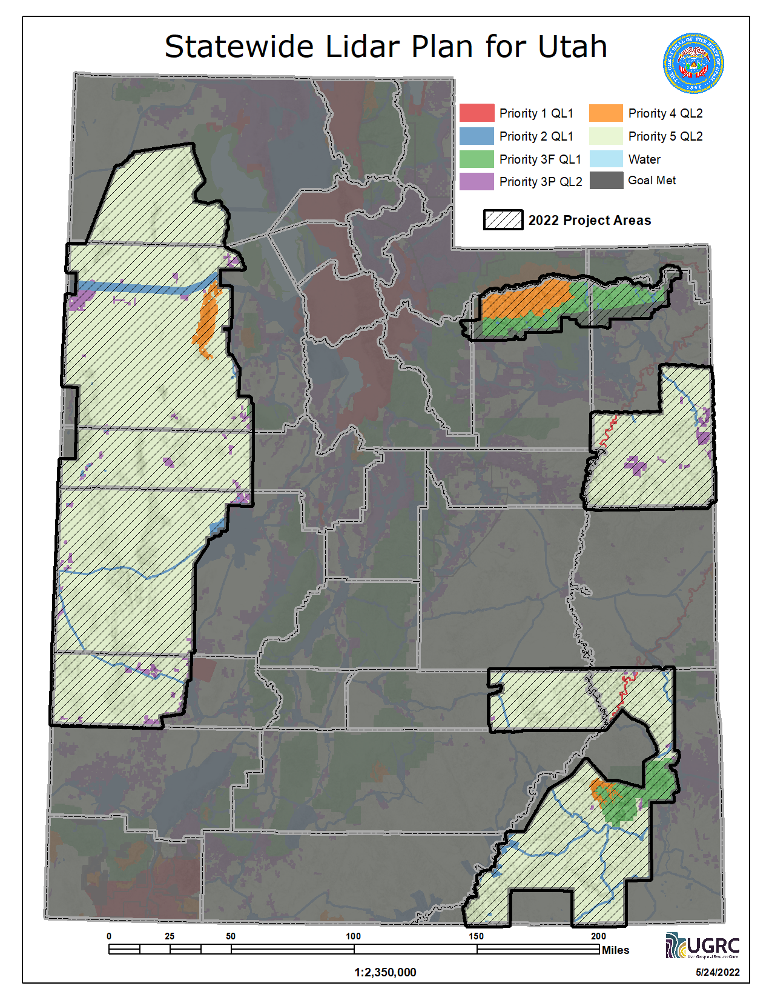
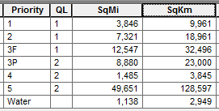

---
author:
  display_name: 'Rick Kelson'
  email: 'rkelson@utah.gov'
tags:
  - 'contours'
  - 'digital elevation model'
  - 'elevation'
  - 'las'
  - 'lidar'
  - 'surface'
  - 'terrain'
date: '2015-08-19 14:29:46 -0600'
update_date: '2022-05-24T01:00:00.000Z'
title: 'Statewide Lidar Plan for Utah'
category: 'Uncategorized'
---

import Contacts from '@components/page/Contacts.astro';

To aid the planning efforts for future Lidar acquisitions in Utah, UGRC and the Utah Department of Natural Resources have collaborated with various local, state, and federal entities to create the foundation for a Statewide Lidar Plan for Utah. The plan includes the <strong><a href="https://docs.google.com/a/utah.gov/document/d/1Z7QPeg9whuOnZP_Y_jOnkZrJsj6hVpqrp3vSkUJhEac/edit?usp=sharing">Lidar Plan strategy document</a></strong>.

The aim of this plan is to provide strategy and vision for Lidar data acquisitions across the State of Utah and to
promote partnerships, cost sharing, and timely, prioritized acquisitions.

The coverage priority map breaks the state into 6 classifications representing priorities relating to transportation,
infrastructure, natural hazards, private lands, etc. At this time, the coverage map doesn't attempt to break the state
into operational flight/acquisition blocks. The 6 categories are:

- Priority level 1: heavily urbanized areas; high profile water, watershed, and land management areas, or prioritized hazard study areas
- Priority level 2: transportation and settled area corridors, high profile recreation areas
- Priority level 3F: forest management areas
- Priority level 3P: other private land or areas with substantial economic value/activity (note: a large portion of
  the Uintah Basin oil and gas field is expected to be moved to this priority level)
- Priority level 4: designated wilderness management areas with external impact (wildfire, watershed) and recreation interests
- Priority level 5: other areas, moderate economic development potential

This is the first draft of a living document that is expected to be refined as additional feedback is received and
analyzed, and as areas get collected and/or re-prioritized.

<Contacts subject={frontmatter.title} contactKey="elevation" />
