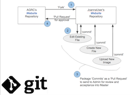
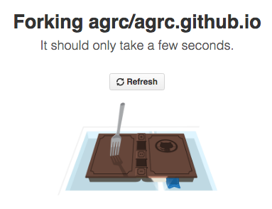
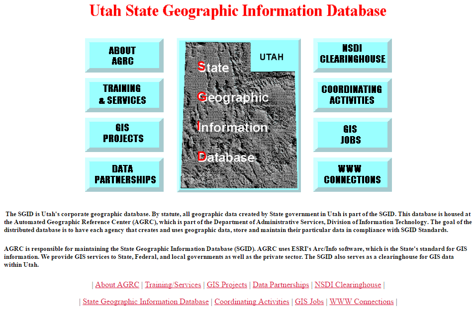
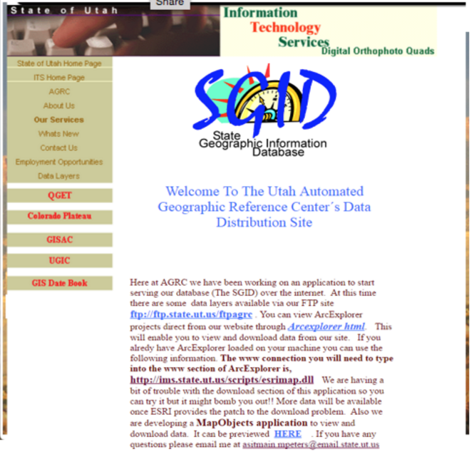
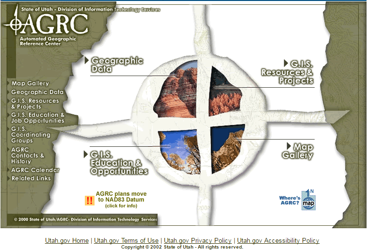
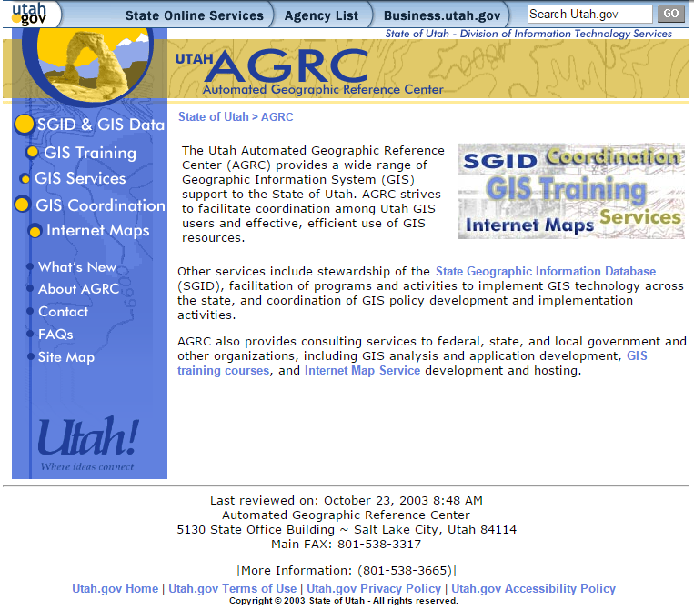
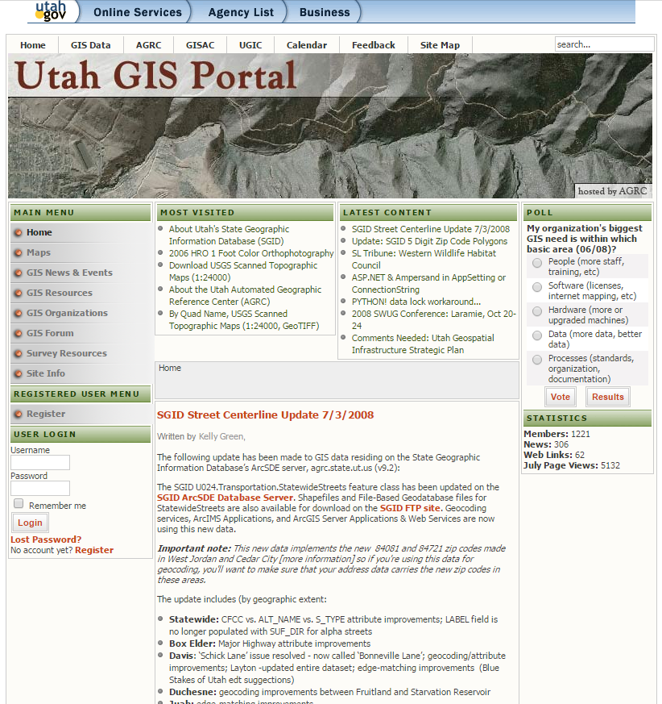
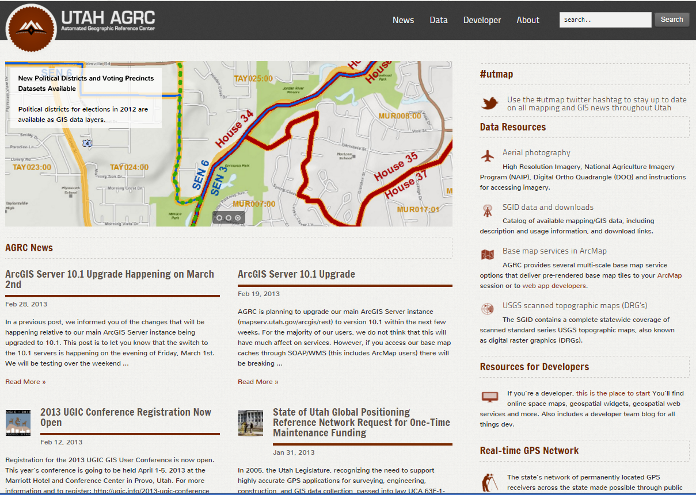

---
author:
  display_name: 'Bert Granberg'
  email: 'ugrc@utah.gov'
tags:
  - 'developer'
  - 'github'
date: '2016-03-25 13:31:17 -0700'
title: 'Now You Know: About the gis.utah.gov v6.0 Refresh'
category: 'Uncategorized'
---

import Contacts from '@components/page/Contacts.astro';

Four years is a long time for anything, and that certainly applies to website releases. For a number of reasons, gis.utah.gov, has been overdue for a refresh.

In releasing the new, updated gis.utah.gov, we feel we have taken logical, evolutionary steps to improve the site and to better reflect the leading trends in GIS and IT. What follows is an overview of the changes we made and then a preview of some intended next steps.

The primary driver behind this release was to solve some nagging issues associated with operating a locally-hosted Content Management System (CMS). Our new GitHub Pages ([GH Pages](https://pages.github.com/)) architecture releases us from the ‘upkeep’ that included care and feeding for WordPress, its associated extensions, a relational database (mySQL), dynamic programming interface (PHP), a server OS, and operation and hosting expenses for a virtual machine. GitHub’s **free** hosting policy for openly-sourced content means we are saving real resources that can be applied to other priorities.

While, it is true that we are putting our faith in the engineers at GitHub to keep their stack [running for us](https://www.githubstatus.com/), we are not solely in the company of freeloaders. The paid services GitHub provides to their top-tier paying customers (many of the largest software firms in the world, including the most prominent commercial GIS software vendor), should ensure we are in good hands. And since all our pages are static (as opposed to dynamically generated from PHP database calls), we could easily port the site to another cloud platform if we ever find the need.

Another nice feature of GH Pages is its cloud-based, static website generator system. Our content repository is at [https://github.com/agrc/gis.utah.gov](https://github.com/agrc/gis.utah.gov), and any time an edit is approved and merged into the repo, the appropriate static pages on github.io servers are updated in seconds. And, through a clever bit of DNS work, the github.io servers are what the world sees as [https://gis.utah.gov](https://gis.utah.gov).

The new architecture allows us to keep the distributed, multi-user editing capabilities expected in a CMS -- anyone can fork our website content repo and submit pull requests, containing the proposed changes, for our approval. In addition to administrative control over the content, GitHub also provides capabilities for easy local backups, and a complete transactional history of the site over time.

We believe this to be the first .gov website hosted on GitHub Pages within Utah, and likely one of the first across state governments. But more importantly, we think some of the new features will prove valuable to our users in the Utah GIS community. These include

- An adaptive design developed in partnership with the Department of Technology Services AppDev/UX team
- Better, easier to find information about Utah GIS data resources
- The [SGID Index Table](/data/sgid-index/), an alternate search method across the SGID inventory
- The beginnings of an authoritative web service data endpoint inventory
- Dataset refresh/update cycle information (later this year)
- And other bells and whistles on their way
- Better site-wide search
- Collaborative editing using either HTML or the greatly simplified Markdown syntax - all you need is a github account to edit a page (or you can still just email us if that’s more convenient)

Keep in mind that this is really the first of two phases. Phase 1 has moved us away from our existing, dilapidated WordPress platform. It will save us a few bucks and will hopefully preserve all of our highly search engine optimized URLs that make Utah GIS data and related resources easily discoverable from a Google key word search. Additionally, the phase 1 build provides us with more options to emphasize the presence of published GIS web services.

We’ve got more work to complete under Phase 1, but Phase 2 blueprints are starting to come together. Phase 2 will involve focusing on filling in gaps in live, streaming map data web services, migrating metadata content currently contained within SGID data package web pages onto a Utah-wide Esri Open Data platform site. We are eagerly awaiting Esri's rumored ‘portal affiliation’ functionality that is being developed for the hosted (AGOL) and local Esri Portal environments. We think this will make it easier to bring together and sustain open and interactive GIS data content across the Utah GIS community.

As always, we welcome and appreciate your feedback on the new gis.utah.gov site. You can reach

<Contacts inline subject={frontmatter.title} contactKey="ugrc" />.

Thanks to [@steve_ugrc](https://twitter.com/steve_ugrc) for the vision, leadership, and GitHub mentoring that got us all to v6.0!

Lastly, check out UGRC's websites over the last 20+ years..

<a href="https://web.archive.org/web/19970716211113/http://www.agr.state.ut.us/">UGRC Website v0</a>

<a href="https://web.archive.org/web/19981201214147/http://www.its.state.ut.us/agrc/">UGRC Website v1</a>

<a href="https://web.archive.org/web/20030214191929/http://gis.utah.gov/">UGRC Website v2</a>

<a href="https://web.archive.org/web/20030214191929/http://gis.utah.gov/">UGRC Website v3</a>

<a href="https://web.archive.org/web/20090323175622/http://gis.utah.gov/">UGRC Website v4</a>

<a href="https://web.archive.org/web/20140701075235/http://gis.utah.gov/">UGRC Website v5</a>

