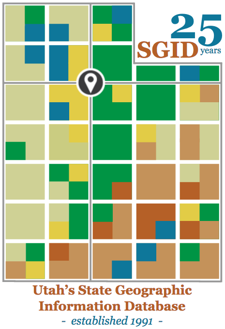
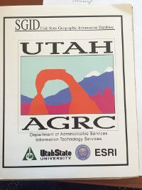
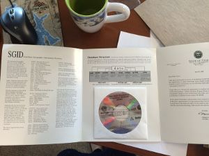

---
author:
  display_name: Bert Granberg
  email: ugrc@utah.gov
tags:
  - clearinghouse
  - coordination
  - data
  - gis history
  - policy
date: 2016-05-24T21:57:21.000Z
title: '25 Years Ago: Laying the Foundation for Utah GIS Success'
category: Collaboration
cover_image: /src/images/pillar-blog/2016-05-24-25th-anniversary-state-geographic-information-database/sgid25years.png
cover_image_alt: SGID 25th anniversary sticker
---

For those of us not in the GIS field at the time, 1991 was a significant year in Utah and beyond...

In March of 1991, Governor Norman Bangerter signed into law Senate Bill 21, sponsored by Senator Dixie Leavitt. That was 25 years ago this Spring and, nationally, it was one of the, if not the first, instances of GIS being codified into state statute.

Commemorative SGID 25th Anniversary Sticker

Happy 25th Anniversary SGID!

At the time, GIS had received significant attention as a result of the political redistricting effort soon underway, and the need that had arisen for systematic study and planning for natural hazards, such as earthquakes. Seven unsuccessful bills were introduced on natural hazards the previous legislative session, resulting in a mandate to study, among other things, state GIS capabilities during the 1990 legislative interim meetings. SB21, subtitled the “Geographic Information Systems Data Sharing and Conformity Bill” was a product of work performed by members and staffers of the State and Local Affairs Interim Committee. [More info](https://drive.google.com/file/d/1H0KaE5JqL5KSNwCK5YTlQGSlbjnEWZfj/view?usp=sharing)

SB21 created, in statute, Utah’s State Geographic Information Database, and tasked UGRC with the responsibility for running the central data repository and clearinghouse for all public GIS data created or acquired by state agencies. Senator Leavitt’s bill also called upon UGRC to establish data standards and provide access and services to GIS users across Utah. Much of the original language remains in place in [63F-1-S507](https://le.utah.gov/xcode/Title63F/Chapter1/63F-1-S507.html).

In many ways, the SGID is a forerunner for current data sharing initiatives promoted under the ‘open data’ banner. The guiding principles behind the SGID back in 1991, seem just as applicable to ‘open data’ today:

- highly discoverable and accessible 'one-stop shopping' should be offered to prospective data users
- the cost/benefit ratio for data development projects improve when the the data is used broadly
- an inventory and widespread use of a central resource makes it easier to identify and prioritize information inadequacies
- decision-making should be timely and made off the same, best available information
- information-sharing promotes lateral links between program staff in related fields/agencies
- reduce redundant data maintenance, services, and storage

_Just for fun, here are a few of the other noteworthy 1991 GIS milestones that are also celebrating their 25th anniversary this year:_

- First meeting of the Utah Geographic Information Council (at University of Utah)
- First meeting of the National State Geographic Information Council (here's [a copy of the faxed invitation](https://drive.google.com/file/d/1a5D0KmXtQqfkIYue3m4ykKZ-fAuzdaAY/view?usp=sharing))
- Esri released ArcView 1.0, the first GUI-based GIS app for basic display and query. The shapefile was likely designed in 1991 but wasn’t released until ArcView version 2.0.
- HP released first inkjet plotters (this was a big deal as pen plotters were limiting and electrostatic plotters used dangerous chemicals and required specific climate-controlled rooms).

Commemorative 'SGID 25 Years' stickers are available in limited
quantity. One size fits all SGID data stewards and SGID data users alike.
Get yours from an UGRC staffer at your next opportunity.

Cover of SGID Data CD, 1995

SGID Data CD, 1995

SGID Data User Guide, 1999

