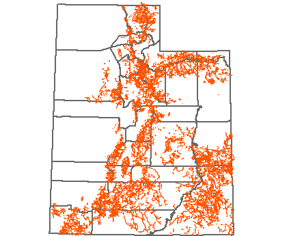

---
author:
  display_name: Bert Granberg
  email: ugrc@utah.gov
tags:
  - data
  - trails
date: 2016-08-31T13:20:00.000Z
title: Utah SGID Trails Data Layer Updates
published: false
category: Uncategorized
cover_image: /src/images/pillar-blog/2016-08-31-utah-sgid-trails-update/statewidetrails.png
cover_image_alt: Statewide Trails Data
---

import Contacts from '@components/page/Contacts.astro';

In July, UGRC staff completed a significant update to the statewide trails GIS map layer. The updates integrated trail data published by each of Utah’s National Forests on the [USFS Geodata Clearinghouse](https://data.fs.usda.gov/geodata/). Additionally, over 190 miles of trails were added from data shared by the Mountainland Association of Governments (MAG).

The USFS trails integration added 2,964 miles of trails to the statewide map layer, picking up many missing trails in less-prominent recreation areas that were not in the initial trails data whose rights were purchased in 2014.

As part of the integration process, a semi-automated process was used to detect differences between the existing map data and the new data published by the USFS and others.

UGRC also built a "quick and dirty" interface to speed up the manual review and acceptance process for new additions and changes. If a conflict between the two map layers was detected, the reviewer used the statewide 6” high resolution imagery to decide which trails data to include in the new updated version.

To access the data, visit the [trails data page](/products/sgid/recreation/trails-pathways), or [interactive map](https://utah.maps.arcgis.com/apps/SimpleViewer/index.html?appid=f3337951e0034ebb889ecebcb3a45f39).

UGRC will gladly integrate additional trails data that can be provided in a digital map format. Please send contributions to <Contacts inline subject={frontmatter.title} contactKey="trails" />.

_Statewide trails_

