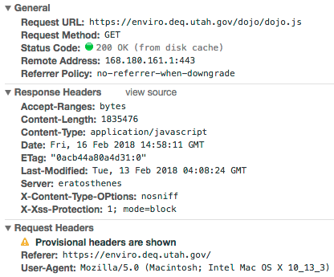
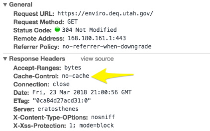
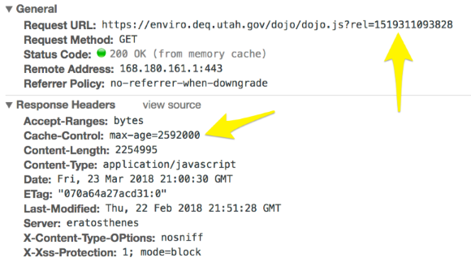

### When Production Is Broken, It Needs to Be Fixed Now!

Recently, the URL changed for one of the map services we use in several of our applications. This came as a bit of a surprise to us, so we quickly updated our applications and deployed new versions. Everything seemed great and we continued on our way. However, two days later one of our clients reported that some of his users still did not have the updated applications in their browsers. As a programmer, I knew that the simple solution was to have them clear their browser caches. But it felt unprofessional for me to walk them through this process when it was something I could fix for them, and it was a skill they really didn’t need to know. So I started doing some digging on how I could solve this problem behind the scenes.

### Head[er]aches

Here's an example of a request for the main JS file for our application:

Notice the "`(from disk cache)`" next to the status code? That means that the browser wasn't even making a request to the server for this file. This is really great for speeding up the loading of the application, but it's not so great when you're trying to get updates to users' browsers. The problem with this request is that because it doesn't specify the `Cache-Control` or `Expires` header, the browser is left playing a guessing game about how long it should cache the resource. The length of time a browser will cache a resource can vary between browsers, so, in general, going along with this guessing game is a bad idea. But we also don't want to completely disable caching either&mdash;it can make a huge difference on page load speed. (Google's Web Fundamentals site has [a really great article on this subject](https://web.dev/http-cache/). This article not only helped me understand the problem, it gave me direction on a solution.)

### The Best of Both Worlds

What if we could cache the majority of our application code to keep it loading fast, but also get updates to our users the first time they load our application after a deploy? The key to making this possible is to disable client-side caching on the main application file, `index.html`, and then aggressively cache all other resources. This keeps our application load time down since `index.html` is nothing more than a [50+ line shell around the application](https://github.com/agrc/deq-enviro/blob/c11865a477be1d5970c457636d9c738df58483e0/_src/index.html).

Here's an example of new headers for this file:

"`Cache-Control: no-cache`" directs the browser to always check the server for a new version of this file. The bulk of the code for our applications is built in to the JS and CSS files. For these files, I added a time stamp to the request (e.g., `/dojo/dojo.js?rel=1519311093828`). This time stamp, implemented via [grunt-cache-breaker](https://github.com/shakyShane/grunt-cache-breaker), is changed each time the application is built. And because browsers cache each resource by its unique URL, when the URL to a resource is changed, the browser will instantly request a new version from the server. This means no more wondering whether my users are getting updates!

_**Bonus tip**_: The [`ETag`](https://developer.mozilla.org/en-US/docs/Web/HTTP/Headers/ETag) header allows a browser to check, before the browser downloads a resource from a server, whether the resource has changed since the last time it was downloaded (thus the `304` status code). In this way, the browser only downloads the resource if the resource has been updated.

Here's an example of new headers for the main JavaScript file for the application:

Once I decided on the headers that I wanted, configuring our [IIS web server](https://docs.microsoft.com/en-us/iis/configuration/system.webserver/staticcontent/clientcache) was [fairly straightforward](https://github.com/agrc/deq-enviro/blob/c11865a477be1d5970c457636d9c738df58483e0/_src/web.config). Here's an example of a commit that implements this entire solution: [https://github.com/agrc/deq-spills/commit/c396cca4f7fc906fd5f965888c0a992b5ae0b9df](https://github.com/agrc/deq-spills/commit/c396cca4f7fc906fd5f965888c0a992b5ae0b9df).

At the end of the day, adjusting the caching settings was the simple solution I was looking for. I could maintain a high level of professionalism, knowing I’d done my job well, and clients could work without interruption.
