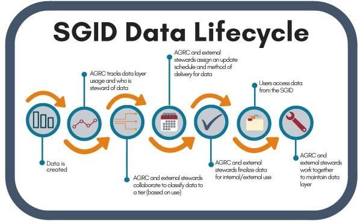

In an effort to ultimately consolidate and organize as much State <abbr title="geographic information system">GIS</abbr> data as possible, <abbr title="Utah Geospatial Resource Center">UGRC</abbr> has been gathering information about <abbr title="State Geographic Information Database">SGID</abbr> data layers managed by UGRC, and we are now reaching out to state agencies to collaborate about agency-specific data layers. Read on to get the full scoop on this effort.

**Let’s go back. Remind me, what is the SGID?**

The SGID was established by state law in 1991 and ensures that GIS map layers are developed in a coordinated fashion and are shared openly. Overall, we’ve got some big-picture goals for the SGID. We want to:

- streamline the SGID data lifecycle process;
- make the currently compiled data clearer and more accessible for all involved parties, from UGRC to local, state, and federal partners; and
- work with agencies to add their data to the SGID/[<abbr title="ArcGIS Online">AGOL</abbr>](https://utah.maps.arcgis.com/home/index.html) and share all the State’s GIS data with an even wider audience at [opendata.gis.utah.gov](https://opendata.gis.utah.gov/).

In the past, agencies completed data maturity assessments, which provide UGRC with a good foundation for updating and consolidating agency GIS data.

**Oh yeah, that’s right. And what is UGRC working on now with the SGID?**

For the past several months, UGRC has been assessing SGID data layer usage in order to identify the most and least frequently used layers. (Read our [“SGID Data Lifecycle”](/blog/2018-02-05-sgid-data-lifecycle) and [“The Incredible Shrinking SGID”](/blog/2018-09-10-the-incredible-shrinking-sgid) articles to get more background about the SGID and our data collection efforts.) Although SGID data layer usage is constantly changing, at this point the most frequently used SGID layers are:

- County Boundaries
- Municipal Boundaries
- Land Ownership
- Roads
- Public Land Survey System (PLSS)
- Zip Codes
- Address Points

**What’s next?**

We’ve compiled enough data that we’re getting to the point where we should be able to: (1) make some decisions about which data layers need to be updated most frequently and (2) determine how we’ll make sure that happens. Since we’ve got a pretty good handle on the data layers managed by UGRC, we’re also now in a place where we can start reaching out to state agencies and help compile and manage their agency-specific data so it’s accessible to a wider audience.

UGRC’s work on this step is underway, as we’ve started a pilot of asking each agency to share agency-specific data with the relevant SGID group, such as “Water,” “Climate,” “Health,” “Political,” or many others, in AGOL. We’ve also asked agencies to add in a few more keywords with their data so when a user is looking at the various groups on AGOL, the user will see the agency data as a component of the enterprise SGID data. If an agency would like UGRC to harvest its data and publish the data for the agency, we can certainly provide that service. We want to focus on data that is used within the agency and also by other agencies. Eventually our goal is to discover other data layers that may not receive high usage but are important to an agency and make those data layers available for download at [https://gis.utah.gov](https://gis.utah.gov/).

**Down the road**

Once we’ve compiled all the UGRC and agency-specific data layers that we can, we’ll be tasked with maintaining those data layers to ensure the quality and accuracy of the State GIS data. UGRC will work with agencies to develop update schedules and determine who is responsible for updating each layer.
