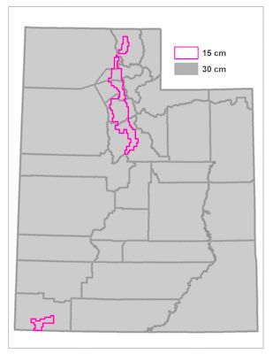

UGRC recently purchased a license to Hexagon’s statewide high resolution aerial photography (6” and 12” pixels) on behalf of Utah state, regional, and local government organizations. Since the purchase, UGRC staff have been working to provide a seamless delivery of the product through the Discover system, like we did with the Google Imagery. The licensing terms of the Hexagon product will remain the same as the terms for the Google Imagery. You can find information on accessing both the Google Imagery and the new Hexagon product on the [Discover section](/products/discover/) of our website.

UGRC would like to thank our partner agencies, whose support made the original Google purchase possible! We’d also like to thank the governor's office and the legislature for the ongoing appropriation of $250,000. UGRC is currently seeking small amounts from many agencies to cover our remaining expenses.

The Hexagon high resolution aerial photography will continue the Google Imagery’s work of providing a valuable, detailed, border-to-border view of Utah's landscape that is expected to improve the quality of agency business data, facilitate more productive data sharing, expedite and enhance decision-making, and reduce the necessity of field data collection. As the Hexagon purchase aligns with an existing private sector acquisition effort, the upfront and maintenance costs to the state are significantly lower than the cost of past custom aerial photography missions.

Currently, the Hexagon imagery is from 2018 and 2019; the 2018 imagery covers the entire state, and the 2019 flight covers the Wasatch Front area and parts of Washington County. **Note: The Utah service currently available from Discover will change to utilize these two Hexagon services.** Also, in 2021 the statewide 12” service will be replaced with statewide 6” service.

We are still working on finalizing the technical details about how to access the Hexagon imagery, but, for now, here are a few questions and answers, and some additional information, regarding the new license model:

- **How will aerial photography update and maintenance costs be covered in the future?** UGRC will use the $250,000 in ongoing funding that we received from a legislative appropriation and supplement it with other funds from willing partners.
- **What does the new Hexagon license mean for the future of custom high resolution aerial photography? Are custom products no longer needed?** The Hexagon imagery license should provide high resolution views needed for much of the mapping and project planning work across Utah. But, there will still be situations that call for custom flights in order to meet tighter, project-specific requirements (e.g., resolution, positioning) or even greater currency than the currency of Hexagon’s update cycle goals (targeted for a three-year refresh cycle statewide). Additionally, at the federal level, we currently expect the statewide one-meter NAIP updates, contracted by the United States Department of Agriculture.
- **Other important information (This list may be updated moving forward.)**:
  - When the Hexagon imagery is uploaded, the older Google Imagery will be kept online and will continue to be available.
  - UGRC will host a polygon map of the Hexagon flight blocks and each flight’s date of collection.
  - UGRC has received a statewide uncompressed master set of the Hexagon imagery files in JP2 format for redistribution; however, we need time to process them. As the download process directly from Hexagon incurs transactional costs for cloud server and bandwidth usage, the files should be available in March 2020.
  - The native coordinate system for the Hexagon imagery files and service is a geographic coordinate system with a WGS1984 datum. Many end users in Utah work in coordinate systems with a different datum (NAD1983, for example). It will be critical for end users who require the highest locational precision to set up their working environment through the use of the appropriate geographic transformation. The correct geographic transformation parameter is needed to overcome the locational difference between the “realization points” of the WGS1984 and NAD1983 datums, which are approximately a meter apart. Without the proper geographic transformation parameter, reprojection algorithms will not be able to resolve the last meter of positional accuracy. For many web applications and coarser-resolution mapping needs, the transformation may not be of importance.
