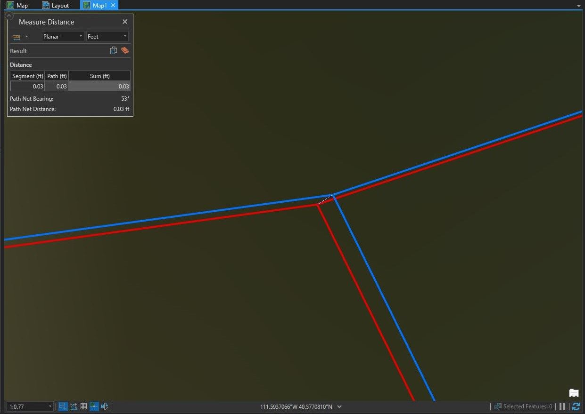
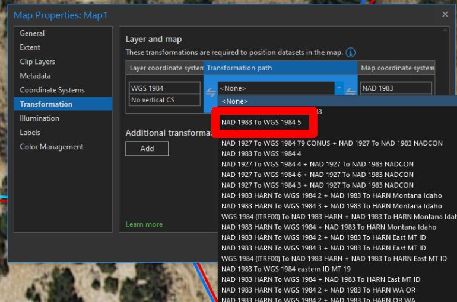
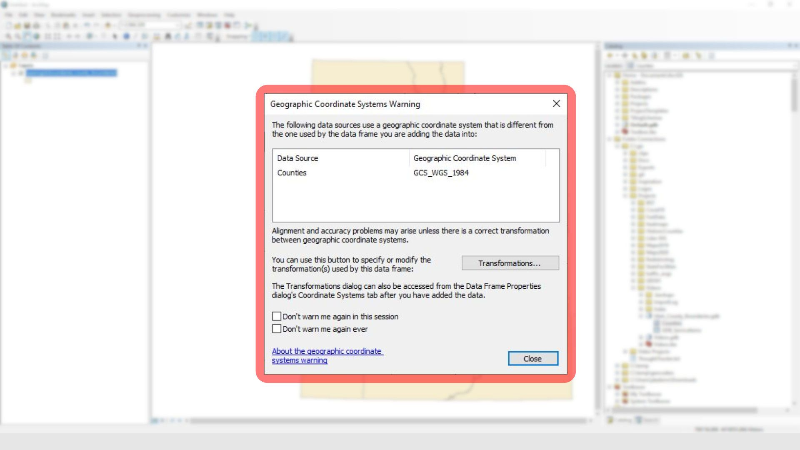
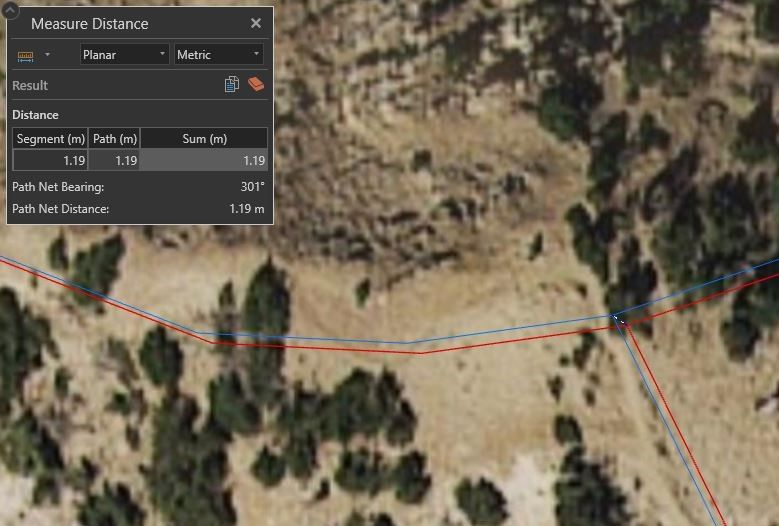
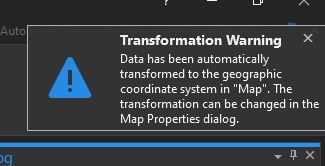
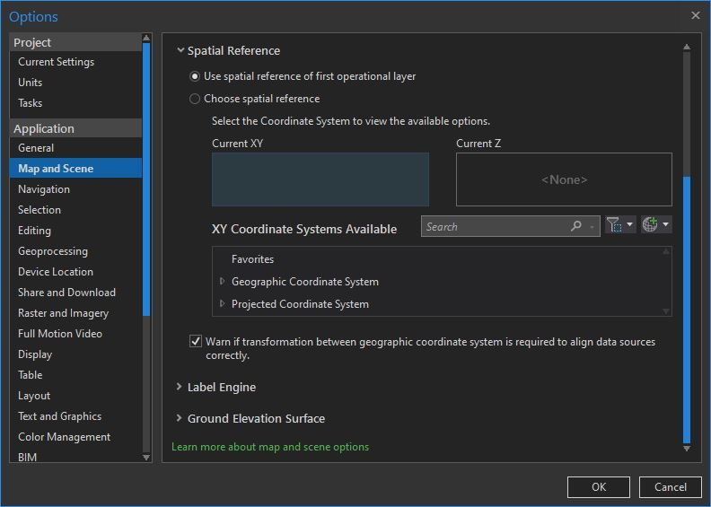
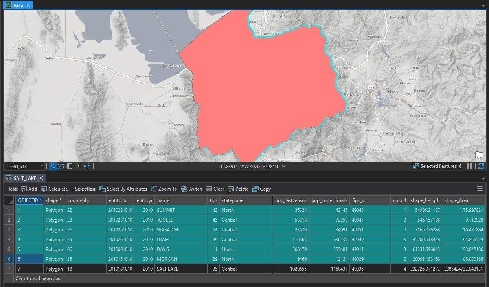
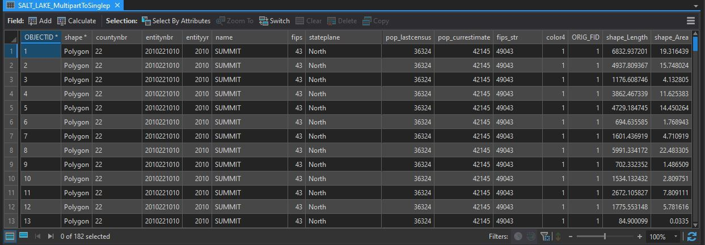

<iframe class="aspect-video mx-auto w-full max-w-4xl rounded-lg border-2 border-black shadow-xl" src="https://www.youtube.com/embed/86RN0rdsMOE?si=TZ06PMj3v6wYhOTx" title="YouTube video player" frameborder="0" allow="accelerometer; autoplay; clipboard-write; encrypted-media; gyroscope; picture-in-picture; web-share" allowfullscreen></iframe>

_From the I Hate Slivers department_

Modern GIS software goes to great lengths to automate the mundane tasks and hide the boring stuff from us. As a relative newcomer to the field, I've heard the old-timers talk about how spoiled we are with on-the-fly projections (now excuse me while I get off their lawn). But really, we are. Being able to display and process data in a variety of projections without first having to reproject it all saves both time and sanity.

This is even more true with the rise of web GIS and external databases. If I were working for a county, I could pull in local data in a State Plane projection, OpenSGID layers in UTM 12N NAD83, and AGOL layers in Web Mercator and they'd all look just about right.

"Just about."

This tiny gap is caused by using the wrong transformation when working with data in projections that use different datums (most commonly NAD83 and WGS84). While it may not matter pragmatically, it can still cause slivers and gaps with certain geoprocessing operations.

In addition to gaps and slivers, propagating data that haven't been properly transformed can also lead to problems working with other data down the road. This is especially important for local governments and others who create and distribute authoritative data. While a lot of GIS datasets have an inherent degree of error in them, we should make every effort we can to preserve what accuracy we have.

## A Brief Refresher on Spheroids, Datums, and Projections

To understand what's going on, let's go through a [brief refresher](https://desktop.arcgis.com/en/arcmap/latest/map/projections/about-the-geoid-ellipsoid-spheroid-and-datum-and-h.htm) on the geodetic foundations that projections are built upon. It all starts with a **_spheroid_**, a simple mathematical approximation of the earth's shape: almost, but not quite, a sphere.

The spheroid is used to create a **_datum_**, which provides a more locally accurate model of the earth's surface. These take into account the "lumpiness" of the earth. A datum can be used as it's own "projection" (really, a geographic coordinate system acting as a spatial reference) to define locations in latitude and longitude. Common datums include WGS84, NAD27, and NAD83.

Side note: the fun part is that datums shift over time, so just saying "NAD83" is actually incomplete. Because a datum can be tied to monuments on earth, it can shift over time due to tectonics. We mostly skip over this fact in GIS ([unless you live on the west coast](https://www.xyht.com/surveying/links-need-seeing-to-datum-epochs-and-how-to-understand-them/), apparently), but a complete definition of a datum also includes the epoch, or the date when it was updated. Unfortunately, support for more detailed projections including multiple NAD83 epochs in ArcGIS requires a [separate download](https://community.esri.com/t5/coordinate-reference-systems/information-on-the-coordinate-systems-desktop-install/td-p/858838), so many people may not have them installed and just gloss over this detail. If the precise location matters down to the inch, you should probably be contacting a licensed surveyor.

Using the word properly, a **_projection_** spreads this datum, this advanced model of the surface of the earth, onto a flat, two-dimensional plane. These are the projections we all know and love (or [hate](https://xkcd.com/977))—Robinson, Mercator, UTM, etc.

Within GIS software, a **_spatial reference_** is the end point of our chain of concepts—it's what we usually mean when we say "projection". It tells the software what the spatial coordinates in the data refer to. A spatial reference can be either a geographic coordinate system in latitude and longitude (a datum) or a projected coordinate system in some planar unit like feet or meters (a projection).

Esri has a great [presentation](https://www.youtube.com/watch?v=kG6vdjDDs8s) from the 2018 Developer's Summit covering these basics.

## Irreconcilable Differences

The WGS84 datum and the NAD83 datum started out as practically interchangeable. However, because WGS84 and NAD83 are adjusted to different areas of the earth's surface (NAD83 focuses on the North American area, while WGS84 focuses on the entire world), they have drifted apart over time like a celebrity marriage.

Because a projection using NAD83 and another using WGS84 are no longer starting from the same spot, any projected coordinates calculated in both no longer match. While the difference is slight on a planetary scale, it often works out to around a meter here in Utah.

## Maybe Not So Irreconcilable

Fortunately, we can use [**_transformations_**](https://desktop.arcgis.com/en/arcmap/latest/map/projections/choosing-an-appropriate-transformation.htm) to figure out the differences between datums. Each different transformation uses its own methods and starting reference points to translate coordinates.

The trick is choosing the right transformation. The pitfall is that ArcGIS Pro may choose a default transformation that is usually just slightly off if you're going from NAD83 to WGS84.

**_Our recommended transformation between NAD83 and WGS84 in Utah_** is `NAD_1983_To_WGS_1984_5`. Other transformations may work better for other geographic areas or for other projections using different datums.

## UTM, SGID, and You

Using the right transformation with SGID data has become more important with the proliferation of AGOL-hosted feature services and the SGID layers shared via [opendata.gis.utah.gov](https://opendata.gis.utah.gov).

Internally, all of the SGID layers hosted by UGRC are kept in the UTM 12N NAD83 projection (EPSG 26912). As its name suggests, this uses the NAD83 datum. If you've downloaded data from us in the past or used our old direct SDE connection, you got UTM data. Our new [Open SGID](/documentation/sgid) database offering also serves out data in UTM.

We've made a large push over the last year or so to host all of our SGID data in ArcGIS Online as well. This allows you to search for data right in ArcGIS Pro or in AGOL webmaps. It also allowed us to set up [opendata.gis.utah.gov](https://opendata.gis.utah.gov), which in turn drives all of the download links on our [data pages](/products/sgid).

**_If you're downloading data from the data pages, or pulling it in from ArcGIS Online, you're getting data in the Web Mercator projection (EPSG 3857)_**. Combining this data with UTM 12N NAD83 data—or any other data that uses the NAD83 datum—may lead to differences between geometries that should be equal.

We use the `NAD_1983_To_WGS_1984_5` for all of our data when working in both UTM 12N NAD83 and Web Mercator.

## When Defaults are at Fault

ArcMap is somewhat helpful when you load data from both UTM 12N NAD83 and Web Mercator—it displays a nice big warning dialog:

I don't know about you, but when I first started doing GIS I didn't know what all this meant (with apologies to my GIS professors in college). My coworker said "Oh, just hit close and move on." So I just got in that habit. Some people probably hit the `Don't warn me again ever` checkbox years ago and forgot all about it.

ArcMap is asking you to choose a transformation. **_By skipping this, no transformation is used at all. The underlying difference between the two datums is left for all to see:_**

_(Yes, I realize this is in ArcGIS Pro, but the result is the same)_

ArcGIS Pro is better about this... and sometimes worse, actually. If you add Web Mercator data to a UTM 12N NAD83 map, it happily chooses a transformation for you. However, it frequently chooses the `WGS 1984 (ITRF00) To NAD 1983` transformation. While very, very similar, this still produces the 0.03 ft difference seen in the screenshot at the top of the page.

**_To be frank, at these distances, the difference from using the default transformation is much less than the potential error in the original data._** It's the classic problem of spurious precision. However, the difference is just large enough to be outside of the default geodatabase tolerances. If you're doing something like a dissolve or split between the two datasets, or trying to enforce topology, you'll get annoying, almost invisible slivers and gaps. The problem we're trying to solve is topological accuracy, not absolute accuracy.

## Can You At Least Give Me a Warning?

By default, it doesn't appear that ArcGIS Pro will give you a warning like ArcMap does. You can, however, enable a little warning popup in the top right of the window (where you've been ignoring that "A software update is available for ArcGIS Pro" message for weeks now):

In the Pro Options dialog, go to the `Application` -> `Map and Scene` entry. Expand the `Spatial Reference` section; here you can choose your default spatial reference for new maps. Below this, there is a checkbox labeled `Warn if transformation between geographic coordinate system is required to align data sources correctly.`

## Show Me The Goods

If you want to see this in action, load our [county boundaries layer](/products/sgid/boundaries/municipal) from both Open SGID (`opensgid.boundaries.county_boundaries`) and AGOL (`Utah County Boundaries`). Make sure the default `WGS 1984 (ITRF00) To NAD 1983` transformation is selected. Then run the `Split` tool between the two layers on the `NAME` field and look at one of the output feature classes. You'll see extra features for most or all of the surrounding counties with pretty small `shape_Area`'s:

If you're feeling particularly crazy, explode the multipart polygons for each neighboring county—I got 182 distinct slivers between Salt Lake County and its neighbors:

## Can I Go Home Now?

So there you have it. At the distances that matter in GIS, the difference between the usual Pro transformation and `NAD_1983_To_WGS_1984_5` is practically irrelevant in day-to-day use. However, it may cause slivers when you run certain operations. If you're not using any transformation at all, the difference is more noticeable. Either way, it may trigger the OCD part of your brain to figure out why your boundaries don't line up.
