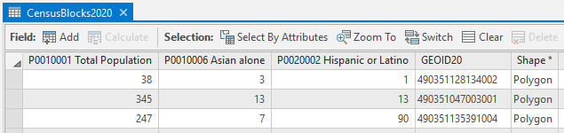
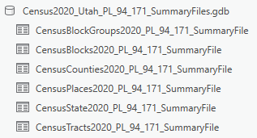
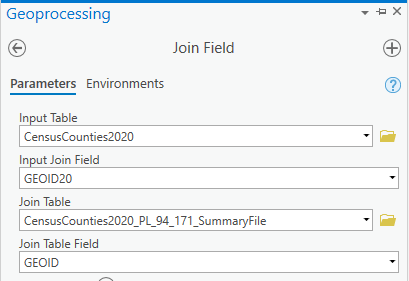

import Contacts from '@components/page/Contacts.astro';

Good news, 2020 census redistricting data is now available for Utah in easy to use GIS formats!

In mid-August, the Census Bureau published the [PL 94-171 Redistricting Data Summary Files](https://www.census.gov/programs-surveys/decennial-census/about/rdo/summary-files.html) from the 2020 Census. This is a pre-release of the 2020 census data, in legacy file format, and contains the elements that pertain to drawing new congressional districts and state legislative districts (state senate and house).

The primary data characteristics released are for most geographies, down to the block level, and show:

- population
- voting age population
- race/ethnicity identification
- occupied and vacant housing unit counts
- group quarters populations

The Census expects to release this redistricting data in more user-friendly formats on September 30, 2021. The full 2020 Census summary files will be released sometime in the not-so-distant future (no announcement from Census yet). The more detailed files were released starting in October of 2011 for the last census, but this decade's release has been 5-6 months behind schedule so far. So make your own guess and cross your fingers.

In the meantime, UGRC, with collaboration from the Analytics Group at [WFRC](https://wfrc.org/), has worked with the mid-August release and has created ready-to-use GIS data in several formats that hopefully make the 2020 redistricting data easier to use.

### PL 94-171 Summary Flies for Census Blocks in GIS format

The exciting news is that key elements from the PL 94-171 Summary Files are now available in the SGID [Utah Census Blocks 2020 GIS layers](/products/sgid/demographic). These elements combine the primary information pieces from across the summary file tables and employ more user-friendly field names (for shapefile users) and field aliasing for geodatabase users.

### PL 94-171 Summary Files for all SGID geographies in tabular GIS format

For users looking for additional data elements, we’ve made available the full PL 94-171 Redistricting Data Summary Files for [download](https://drive.google.com/uc?id=1p8-tWujKXXlH-VjFDLkRJ06VB207_Rmx&export=download) in ESRI File Geodatabase tabular format. These tables can be joined to the corresponding SGID GIS data layer, using the `GEOID` field.

Note that the field names in these tables follow the traditional census field naming convention. You can find detailed information on field names, including descriptions, in the Census PL 94-171 [technical documentation](https://www2.census.gov/programs-surveys/decennial/2020/technical-documentation/complete-tech-docs/summary-file/2020Census_PL94_171Redistricting_StatesTechDoc_English.pdf) or in [Excel spreadsheet](https://www2.census.gov/programs-surveys/decennial/rdo/about/2020-census-program/Phase3/SupportMaterials/2020_PLSummaryFile_FieldNames.xlsx) format.

### Streamlined Race Data

Additionally, the Analytics Group at [WFRC](https://wfrc.org/) streamlined the race fields in the 2020 block data and made it available for [download](https://drive.google.com/uc?id=1sv6pAi-fn6UPbMHJ2BZzIM9ApBRAZLVP&export=download). This tabular data can be joined to the [CensusBlocks2020](/products/sgid/demographic/census-2020-blocks) GIS layer using the GEOID field. Here's a bit on the methodology that was used:

> The decennial census form allows for respondents to report single and multiple racial identifications. Accordingly, the redistricting release of the 2020 census results includes counts for both single race identification and each combination of racial identifications made when more than one was selected. This table sums, for each racial group, the single racial identification count with a count of the multiple race identifying respondents that included an identification for that specific racial group. Fields that sum across single and multiple racial identification carry the "ANY" at the end of their field name header. Note that summing the counts across the ANY fields will produce a count of the number of identifications made (single and multiple) which will be much greater that the total population count.

### Data for everyone

While PL 94-171 Summary File data is released under the banner of redistricting, let's not overlook that it's the first wave of census demographic data and it's open for use in any scenario that you can dream up.

You can find more information on this data, including how to access it, on the UGRC [2020 Census data pages](/products/sgid/demographic).

If you have any questions about the data or the processes used, please reach out to <Contacts inline subject={frontmatter.title} contactKey='census' />.
