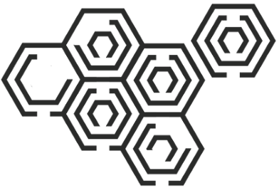
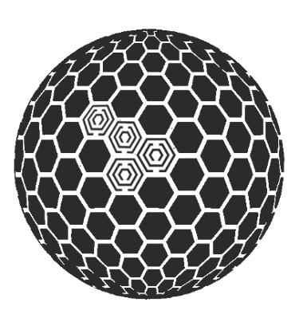

import Contacts from '@components/page/Contacts.astro';

### Many Hands Make Light Work

It’s been said that it took about [100,000](https://www.historymuseum.ca/cmc/exhibitions/civil/egypt/egca12e.html#:~:text=The%20Greek%20historian%20Herodotus%20was,creates%20a%20very%20stable%20structure.) humans to build the Pyramids of Giza and a [similar number](https://www.peoplesworld.org/article/today-in-labor-history-panama-canal-built-by-75-000-opens/) to build the Panama Canal. Prior to the internet, large-scale collaboration is generally thought to be limited to that number. Any more, and it became difficult to manage. What made these projects successful is that they were well-organized and that they adhered to a set of standards. Today we are able to collaborate with an infinite number of people, however, organization and standards are still limiting factors.

### Geospatial Collaboration

Geospatial folks are some of the best collaborators. For one, geospatial data is inherently visual. Much like adding pieces to a puzzle, it’s rewarding to assemble. Second, geospatial folks generally speak the same language. In the early days, most folks in the industry were using [ESRI](https://www.esri.com/en-us/home)
products and were creating and sharing data in similar formats; this is generally still true in the public sector. Collaboration is embedded in the geospatial community

What's exciting now is that technology continues to make this easier. Because of this, we have entered a time when siloed data should be a thing of the past. The individual work that we do can now be aggregated together to form a seamless, uniform fabric of our world. As geospatial folks, we are weaving the fabric. This is particularly true with authoritative data.

### Authoritative Data

In general, authoritative data can be defined as data provided by a recognized source such as a surveyor or governing entity (ie, an entity that is authorized to develop or manage the data, such as a governmental jurisdiction).

Authoritative data is different from crowd-sourced and proprietary data. Users should understand any limitations or restrictions when working with either of these data sources, as each of them have best-suited use cases.

The clearest use cases for authoritative data are solutions for systems like emergency management, 911, elections, health, and taxation. These support vital government services such as election ballots, public safety, and taxation rates. It is important to have a clearly defined steward with full accountability for the data.

Authoritative datasets have a wide array of use cases, and it is important that we turn to them first when possible.

### Stewardship and Aggregation

Authoritative data is typically woven together through a process of aggregation. In this model, there are data stewards and data aggregators (with occasional overlap). Ideally, the data stewards are the folks who are governing or who are closest to the assets. This is often local government for datasets such as address points, land parcels, and road centerlines.

Data aggregators, such as UGRC, have a wider scope and tend to be positioned at the state and national levels. The role of the aggregator is to build relationships with the stewards, standardize and aggregate a final product woven together from their data, and make the final product available to a broader audience.

This steward-aggregator model has well-defined roles and contains accountability at all levels. One of the many benefits of this is that when an asset (such as an address point) is created or modified, it is done at the authoritative source. Through aggregation, all downstream users benefit from the enhancement. This eliminates duplication and promotes a single source of truth for the data. It also ensures that users from the local to the national level are using the same data. This is great because the more the data is used, the better it becomes.

### Data Standards and the Role of Advisory Groups

The Pyramids of Giza and the Panama Canal were not built overnight. Their success not only hinged on collaboration and organization but also established [standards](https://www.fgdc.gov/ngac/meetings/march-2017/ngac-paper-geospatial-standards-a-national-asset.pdf). Without standards, it’s difficult to ensure that the individual pieces fit together.

Today, the geospatial fabric is held together by collaboration, relationships, and agreed-upon standards. Much like collaboration and relationships, standards require communication among stakeholders. A big part of this is understanding our roles and eachother's goals.

Data stewards typically maintain data for specific purposes, however, as we communicate we discover that we share common goals. Agreeing on these details allows us to greatly increase the efficiency and speed of aggregation within statewide or national datasets.

Geospatial advisory groups are a great place to communicate and discover common goals. A few examples of these include the [Federal Geospatial Data Committee](https://www.fgdc.gov/) (FGDC), the [National Geospatial Advisory Committee](https://www.fgdc.gov/ngac) (NGAC), the [Open Geospatial Consortium](https://www.ogc.org/) (OGC), and the [Utah Geospatial Information Advisory Committee](/collaboration/) (GISAC). These groups exist to ensure that the wider geospatial community is being heard and that we are collectively moving forward together. By taking an active role in one of these groups, you can help to ensure that your industry is represented and that the work you do fits together to form the larger fabric.

### Utah Geospatial Information Advisory Committee (GISAC)

If you maintain geospatial data in the state of Utah, you should consider joining GISAC’s Surveying and Mapping committee. This committee works to develop and update data content standards and to consolidate statewide mapping requirements for the most widely used geographic data in Utah. These standards are only valuable if they are being implemented, and the best way to encourage their implementation is to collectively take ownership of them. This is where your voice matters.

Established standards and best practices are key to speedy and efficient data updates. Ultimately, we all benefit from standardized data through improved emergency services, accurate election ballots, and timely grocery deliveries.

### The Proof is in the Pudding

If we're doing it right, the geospatial fabric should stretch across the nation and eventually the globe. In other words, the authoritative data created at the local level will be the same data showing up in broader statewide, national, and even international datasets. A great example of this in action is comparing the locally-sourced address points in Utah’s [State Geographic Information Database](https://opendata.gis.utah.gov/datasets/utah-address-points/explore) (SGID) with address points in the [National Address Database](https://usdot.maps.arcgis.com/apps/instant/minimalist/index.html?appid=2c27531e71b94d48b1a4e12207e7f2c3) ([NAD](https://www.transportation.gov/gis/national-address-database)). The magic happens because of the well-established relationships and the steward-aggregator model in place in Utah. However, there is room for improvement. The best thing we can do now is to focus on establishing data standards so we can update these datasets more frequently.

Our goal is to efficiently weave authoritative data together in a timely manner so that end users are able to access a single stream of data that helps everyone make data-driven decisions. Collectively, we all play a role in this process, and it's rewarding to know that the data we create is being used in broader systems to solve large-scale problems.

If you would like to learn more about GISAC or one of its five subcommittees, including the Survey and Mapping Committee mentioned earlier, please reach out to <Contacts inline subject={frontmatter.title} contactKey='gisac' />.

