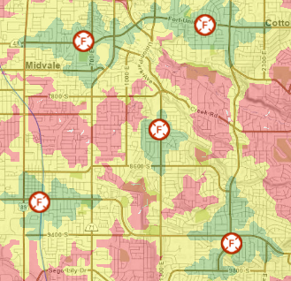

import Contacts from '@components/page/Contacts.astro';

Living close to a fire station can be noisy, but on the other hand, not living close enough can result in delayed, or even worse, inadequate fire service. The [National Fire Protection Association](https://www.nfpa.org/) (NFPA) recommends a total response time of [six minutes](https://www.purvis.com/current-state-of-turnout-times/). This includes one minute for dispatch, one minute for turnout (getting out of the station), and four minutes for travel. Ideally, all occupied buildings in the US would be located within this six-minute window, or response zone. This is where Geographic Information Systems (GIS) come into play. GIS can help us visualize these response zones and also identify neighborhoods with inadequate service.

### The SGID

In Utah, the best place to begin any GIS project is with the [State Geographic Information Datasource](/products/sgid) (SGID). The SGID is hosted by the [Utah Geospatial Resource Center](/) (UGRC) and contains hundreds of statewide geospatial datasets, many of which are considered framework data layers that are used in larger government systems such as 911, voting, and taxation. Because of this, data in the SGID is updated frequently and adheres to established [policies and standards](/documentation/policy/sgid).

### Show me the map

When exploring the question, _Is Your Home Close Enough to the Nearest Fire Station?_, I was able to [search the SGID](/products/sgid/sgid-index) data offerings and quickly locate the statewide fire stations layer, the road centerline network dataset, and a base map. After applying some basic network analysis, I was then able to create an interactive map showing the **[Standard Network Travel Times from Fire Stations in Utah](https://arcg.is/0T01i4)**.

This map shows standard travel times (aka: keeping the speed limit) at intervals of two, four, and six minutes. As you explore the interactive map, you will notice that some areas in Utah fall outside of a reasonable response time. Mapping this data allows us to easily identify and explore these areas.

### Maps and Visualization

Maps are a great starting point for conversations such as, _What areas are currently being serviced?_ and, _Where are the best locations for new or enhanced services?_ The fire stations map is a good example of this.

Using maps to visualize data is powerful. If a picture can paint a thousand words, then a map can initiate a thousand conversations.

With the SGID, access to high-quality, authoritative data is a few clicks away. I encourage you to begin your next spatially-oriented question with the [SGID Index search tool](/products/sgid/sgid-index).

GIS enables us to ask big questions and get reliable answers.

If you have any questions about geospatial data or mapping please reach out to <Contacts inline subject={frontmatter.title} contactKey='ugrc' />.
