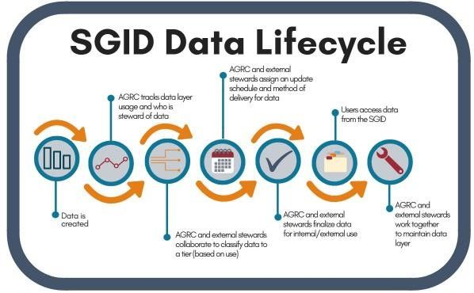
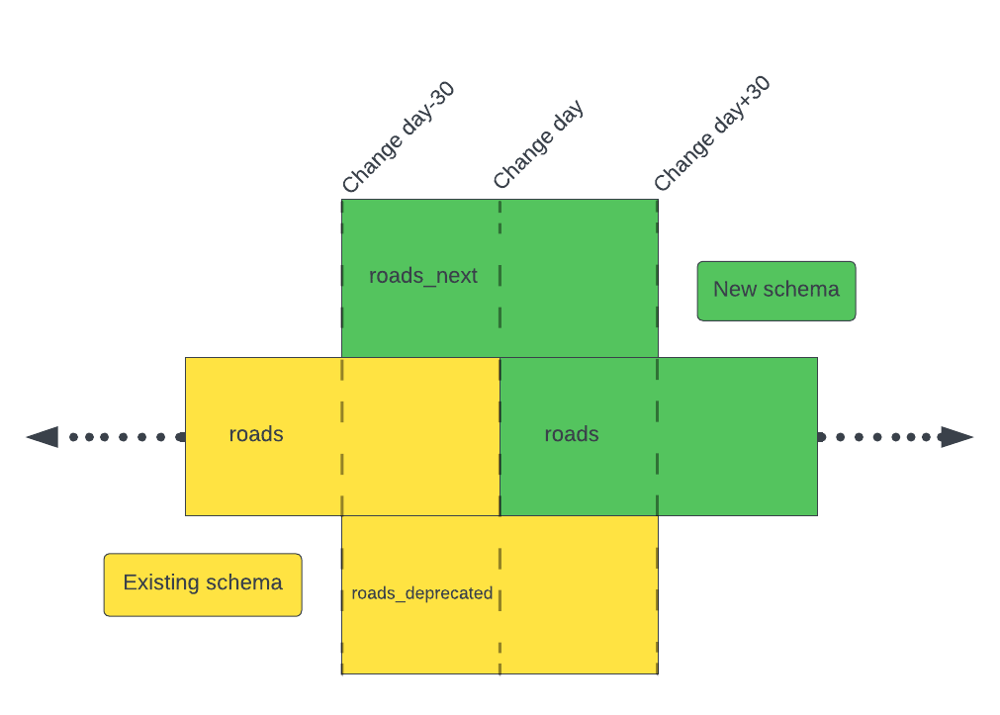

In today's fast-paced and interconnected world, GIS data are a key part of decision making and provide the backbone of innovation and progress. These roles demand high quality data with a methodical [data creation and maintenance strategy](/blog/2018-02-05-sgid-data-lifecycle) that makes it easy on you when data are added, removed, or changed. We are excited to share our latest efforts to provide consistent and reliable access to our high-quality SGID data.

## Dealing with Deprecations

You need to be informed when data are replaced, abandoned or retired, or no longer receiving updates so you can continue to make educated decisions based on the most accurate data. This critical part of the geospatial data lifecycle (GDL) is often overlooked. For example, ArcGIS Online didn't gain the "Deprecated" flag for old and outdated items until 2021[^deprecated]. To this day, that piece of metadata still does not [propagate through the platform](https://community.esri.com/t5/arcgis-online-ideas/use-deprecation-flag-through-platform/idi-p/941737), nor is it available to [ArcGIS Server Services](https://community.esri.com/t5/arcgis-enterprise-ideas/allow-marking-arcgis-server-services-as-deprecated/idi-p/1281015). Deprecating data is a difficult task without an easy solution.

## Processing Change with Porter

UGRC uses the public [agrc/porter](https://github.com/agrc/porter/issues?q=is%3Aissue+is%3Aopen+sort%3Aupdated-desc) repository hosted on GitHub to inform you about changes in the SGID. The issues in this repository provide transparency about our intent and progress while allowing public feedback throughout the process. We also post notices for each issue on our social media channels using the [#ugrcporter](https://twitter.com/hashtag/ugrcporter) hashtag; like and subscribe!

We know these platforms don't reach everyone who needs to know about these changes--please know that we are trying our best 💙️. We are continuing to innovate and explore ways to improve our communication.

## Changing Schemas

Our most recent challenge with our GDL comes from changing the schema of an existing SGID table. As per our [policy](), replacing a schema is a breaking change that we historically handle by removing the existing table and introducing a new table with a unique name. For example, the current table "Roads" has been known as "StatewideStreets" and "Centerlines" throughout its history.

Removing and replacing a table like this severs all connections to it through the UGRC API and desktop GIS clients. This is good for avoiding confusion about schemas and requires you to investigate the broken service to repair it. It's not always possible to introduce a new table name that is as descriptive and relevant as the one it is replacing. With this most recent schema change, there is no equivalent or improved alternate name.

Our first thought, based on our [current process](#general-removal-policies), is to rely on a notification period to give you a chance to prepare for the change, then delete the existing table and add the new table under the same name. This would avoid severed connections, but you don't have any time with the new data to prepare for the new schema.

How can we update the schema without creating headaches for you?

## An Overlapping Solution

The updated process was created using the collective knowledge and experience from everyone in our office. It will allow everyone to plan ahead instead of reacting to breaking changes. It will provide more flexibility to migrate on your schedule instead of having to be ready on our arbitrary data change day, and it will allow us to use the most descriptive table names to continue to make data easy to find. The process is best described with a picture:

Let's use `roads` as an example. When the porter issue is opened and the new data is ready, it will be loaded into the SGID with an `_next` suffix as `roads_next`. This dataset will contain the new schema and data for the lifetime of the change period. At the same time, the existing table will be copied and added with the `_deprecated` suffix. The existing table, `roads`, will remain unchanged for the first half of the process.

On the change day, the existing table, `roads`, will be migrated to the new schema and data and will be equivalent to `roads_next`. The old data will still be available as `roads_deprecated`.

After giving you some extra time to finish your transitions, the `_next` and `_deprecated` tables will be removed.

## The Overlapping Benefits

With this process, you will have time to migrate and test your integrations with the `_next` data and schema. You will not need to be on call on the change day because the `_next` table is still available, and when you migrate to the root table you will have the confidence that comes from testing with the equivalent `_next` table.

If you know that you will not have time to migrate until after the change date, you can migrate to the `_deprecated` table from the beginning and then do your testing after the change date when your schedule allows.

For those that our communication efforts do not reach, the `_deprecated` table will allow them to immediately fix any broken applications or systems that were depending on the data and schema in the root table. This still allows for time to plan their migration to the new table without completely having the rug pulled out from under them.

As you can see, this process allows those that choose to stay informed to prepare, plan, and act on these inevitable changes ahead of time. For those that are not informed, it provides a chance to react and recover. We are very happy with this process and will solidify it into our website in the coming weeks. We are curious to hear what you think of the process and to learn about any processes that have worked for you and your company for managing change.

[^deprecated]: "End Confusion with This Process for Deprecating Items" esri <https://www.esri.com/about/newsroom/arcuser/end-confusion-with-this-process-for-deprecating-items/> Retrieved 23 August 2023
