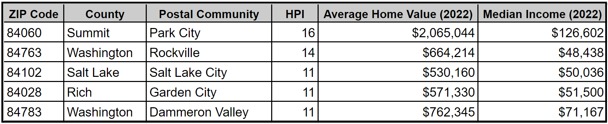
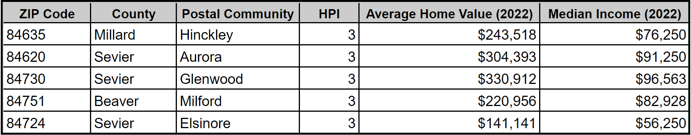

import Contacts from '@components/page/Contacts.astro';

Utahns are feeling the squeeze, and there's data to back it up. Housing affordability has become the top concern for residents, according to a recent [2024 Utah Foundation survey](https://www.utahfoundation.org/wp-content/uploads/rr819.pdf).

That’s not surprising, given the median sales price of a home in Utah is [$535,000](https://www.redfin.com/state/Utah/housing-market). For context, that’s [27% higher](https://www.redfin.com/us-housing-market) than the national median.

To afford the median mortgage in Salt Lake City, you would need a household income of [at least $140,000](https://www.axios.com/local/salt-lake-city/2023/11/02/affordable-home-slc-house-mortgage-prices), significantly higher than the city’s median of $92,000. These numbers validate that income does not match the cost of housing.

Let’s zoom out a bit and explore housing affordability in other parts of the state.

## Housing Affordability in Utah

Housing affordability refers to the relationship between the cost of housing and a household's income. It measures how easy or difficult it is for a resident to afford a home.

For this affordability analysis, we’ll be using a home-price-to-income ratio. Home prices have historically had a relatively stable relationship with income, making this ratio a good indicator of affordability.

This ratio is a simple mathematical equation that helps determine housing affordability by dividing the median house price by the median household income. For example, a median house price of $500,000 divided by a median household income of $100,000 equals a home-price-to-income ratio of 5.

Most [experts agree](https://www.fidelity.com/viewpoints/personal-finance/before-buying-house) that a ratio higher than 5 indicates a decline in homebuyer affordability.

Of the 166 Utah ZIP codes we analyzed for this study, we found that 60% have a home-price-to-income ratio greater than 5.

Here are the 5 least and most affordable ZIP codes in Utah in terms of home-price-to-income (HPI) ratio.

### Least Affordable ZIP Codes

### Most Affordable ZIP Codes

_Explore other ZIP codes with our interactive map below._

## What is being done to alleviate housing prices?

Utah faces a worsening housing affordability crisis. The state's population is booming, but there aren't enough homes to keep up. The University of Utah’s Kem C. Gardner Policy Institute study predicts a [shortage of over 37,000 units](https://d36oiwf74r1rap.cloudfront.net/wp-content/uploads/State-Of-Housing-Sep2023.pdf?x71849) this year.

To address this, Governor Cox aims to create [35,000 new starter homes by 2028](https://utahnewsdispatch.com/2024/03/29/housing-market-utah-gov-cox-goal-starter-homes). The goal is to meet the needs of Utah's growing population and make homeownership more attainable.

Salt Lake City is already experiencing a surge in building permits, with March 2024 seeing an [81% increase](https://www.axios.com/local/salt-lake-city/2024/05/06/single-family-home-building-permits-increase) compared to the same month last year.

Another bright spot is the increase in [multi-family housing units](https://www.utahbusiness.com/multifamily-housing-options-utah/) under construction.

## Continued Growth

Unfortunately, new housing construction hasn't matched Utah's booming economy (ranked [#1](https://www.utahbusiness.com/multifamily-housing-options-utah/) ) and population growth ([#2](https://www.utahbusiness.com/multifamily-housing-options-utah/) ), leading to long-term affordability concerns.

With easy access to recreation, booming job growth, and a high quality of life, Utah's growth shows no signs of slowing.

## Interactive Map

Explore Utah's housing affordability with our interactive map and see where your neighborhood stands compared to others.

### Showing home-price-to-income ratio by ZIP Code for the year 2022

<iframe
  class="mx-auto aspect-video w-full max-w-4xl rounded-lg border-2 border-black shadow-xl"
  title="Housing Affordability in Utah"
  src="https://utah.maps.arcgis.com/apps/instant/basic/index.html?appid=057fefdcada0440f86279c4ae6386233"
  frameborder="0"
  style="border:0"
  allowfullscreen
></iframe>

### Methodology

We used the most currently available data from the [US Census Bureau's American Community Survey](https://www.census.gov/programs-surveys/acs) (ACS) along with [Zillow’s Home Value Index](https://www.zillow.com/research/data/) for this analysis. ZIP Codes were used because they were the common denominator (present) in both datasets. Note that we excluded ZIP Codes that did not have data in one or both datasets from this analysis.
